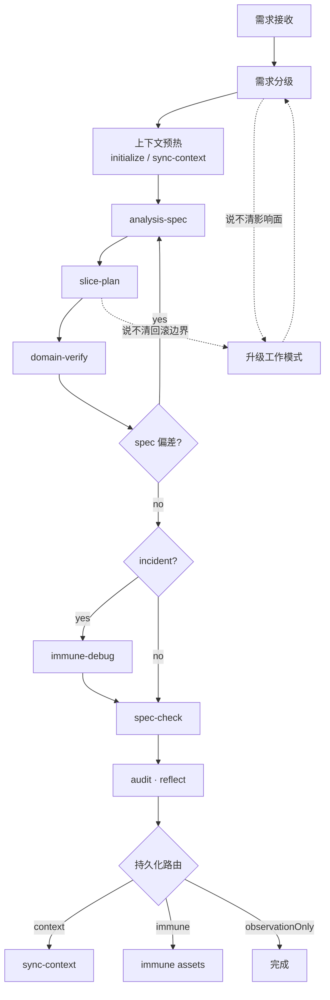

# 分析驱动 SDD

一条共享分析骨架，前端是默认 lens。后端和混合需求复用同一主链，领域差异通过 lens 和 verify pack 装配。

---

## 流程



三条回路：

1. **verify → analysis-spec**：验证发现 spec 遗漏或偏差，回到分析修正。
2. **classify / slice → 升级工作模式**：任何阶段发现影响面或回滚边界说不清，升级后重新进入。
3. **audit → sync-context**：reflect 结论写回上下文，供下一轮 preflight 消费。

---

## 阶段卡片

### Preflight

| | |
| --- | --- |
| **输入** | 原始需求、上下文材料、约束 |
| **动作** | 收集需求 → 需求分级（`patch-lite` / `feature-slice` / `migration-strict`）→ 上下文预热 |
| **输出** | 工作模式、相关 refs、当前 uncertainty、激活的 lens |
| **退出门禁** | 工作模式已确定；目标模块可定位；不确定项已显式列出 |
| **触发** | `请先做 request-classification 和 sync-context 预热` |

---

### analysis-spec

内部有 4 个 phase，按顺序执行。不是黑盒，是四步认知链。

#### Phase A — Observe（现状摸底）

回答"现在是什么"。

- 当前用户路径与页面状态
- 入口点：路由、组件树、状态源、API、埋点
- 共享依赖与风险点
- 验证缺口与兼容承诺

`patch-lite` 可压缩但不可跳过。`migration-strict` 要额外覆盖共享依赖边界、兼容承诺、staged rollout 约束。

#### Phase B — Retrieve（自学习）

回答"我已经知道什么"。

读取三层输入：

1. **流程层**：过往 reflect、SDD 沉淀、immune 资产
   - **正式 immune**（`immune-registry.yaml`）：已验证的长期防护，如回归测试、规则、文档化的已知陷阱 → **硬约束，必须尊重**
   - **候选 immune**（`immune-candidates.yaml`）：范围或证据尚不充分的观察 → **弱信号，只提醒不拦截**
2. **项目层**：`.project-context`、项目规则、共享模式
3. **模块层**：目标模块架构、入口点、已知风险

输出为一张**三色置信度状态表**，对每个关键问题标注置信度：

| 状态 | 含义 |
| --- | --- |
| 🔴 **Red** | 缺失关键信息，自学习无法回答，必须向用户澄清 |
| 🟡 **Yellow** | AI 基于证据做了推测，展示推理过程，由用户决定是否需要澄清 |
| 🟢 **Green** | 通过代码、文档、测试或用户历史回答已确认 |

示例输出：

| # | 问题 | 状态 | 依据 / 推理 |
| --- | --- | --- | --- |
| Q-1 | 后端是否支持分页参数 | 🟡 | 接口返回结构含 total 字段，推测支持 |
| Q-2 | 默认每页条数 | 🔴 | 无任何上下文提及 |
| Q-3 | Table 组件是否支持分页 | 🟢 | references.yaml 中有示例 |

`patch-lite` 仍需产出状态表或显式标 `n/a`。

#### Phase C — Clarify（多轮澄清）

基于 Phase B 的状态表，与用户进行多轮澄清，直到高优先级问题全部变绿。

**第一步：展示状态表并提示用户**

> 以下 🔴 项必须回答才能继续。🟡 项是我基于现有证据的推测（推理过程已列出），你可以：确认推测、要求澄清、或标记为可接受的工作假设。

**第二步：用户选择澄清粒度**

| 模式 | 行为 | 适用场景 |
| --- | --- | --- |
| **严格** | 🔴 + 所有 🟡 逐条澄清 | 线上功能、迁移、高风险改造 |
| **标准** | 🔴 必须澄清，🟡 由用户挑选 | 日常 feature-slice |
| **宽松** | 只澄清 🔴，🟡 接受为工作假设 | 探索、POC、内部工具 |

如果用户不显式选择，`migration-strict` 默认严格，`feature-slice` 默认标准，`patch-lite` 默认宽松。

**第三步：多轮收敛**

每轮：
1. 用户回答当前批次问题
2. AI 更新状态表（红→绿、黄→绿，或新信息触发新的红/黄）
3. 检查准出条件

**准出条件**：
- 所有 🔴 变成 🟢
- 所有 🟡 要么变成 🟢，要么被用户显式接受为工作假设（标记为 `🟡 Accepted`，进入 analysis-spec 时计入 Assumptions）
- 如果某轮澄清后没有新增 🔴 且用户不再挑选 🟡，退出

#### Phase D — Specify（目标规格）

综合 Phase A-C 产出分析包。此时按需装配已激活的 lens（见"Lens 定义"）。

`analysis-spec.md` 最小输出结构：

| section | 内容 |
| --- | --- |
| `Baseline` | Phase A 的现状摘要 |
| `SelfStudy` | 三色置信度状态表（🔴 / 🟡 / 🟢） |
| `ClarifyResolutions` | 多轮澄清结论，含用户确认和 🟡 Accepted 项 |
| `ActivatedLenses` | 本次激活了哪些 lens |
| `TargetBehaviors` | 目标用户路径、状态矩阵、验收标准（编号） |
| `NonGoals` | 明确排除的范围 |
| `RiskInventory` | 风险清单、risk hotspot、反例 |
| `EvidencePlan` | 每条 TargetBehavior 对应的验证方式 |

| | |
| --- | --- |
| **退出门禁** | 每条 TargetBehavior 可验证；无"实现时再看"的模糊表述；deferred 项已显式标记 |
| **触发** | `请完成 analysis-spec：observe → self-study → clarify → specify` |

---

### slice-plan

| | |
| --- | --- |
| **输入** | `analysis-spec.md` |
| **输出** | `slice-plan.md`（每个 slice：目标行为、受影响文件、风险、验证方式、回滚方式） |
| **退出门禁** | 每个 slice 可独立验证、独立评审、独立回滚；高风险改造有 compatibility slice 或 feature flag |
| **触发** | `请基于 analysis-spec 产出 slice-plan` |

每个 slice 必须引用 `analysis-spec.md` 中的 `TargetBehaviors` 编号。

---

### domain-verify

| | |
| --- | --- |
| **输入** | `slice-plan.md`、对应 verify pack |
| **输出** | `verify.md`（每项标记 `pass` / `n/a` / `deferred`） |
| **退出门禁** | 当前 slice 满足对应 verify pack；deferred 项有原因和风险 |
| **触发** | `请按 verify pack 验证这轮交付` |

如果验证发现 spec 偏差，回到 analysis-spec 修正后重新 verify。

---

### spec-check

| | |
| --- | --- |
| **输入** | `analysis-spec.md` 的 TargetBehaviors、`verify.md` |
| **输出** | `spec-check.md`（逐条对账：`as_specified` / `intentionally_changed` / `deferred` / `abandoned`） |
| **退出门禁** | 每条 TargetBehavior 都有归宿；无隐性偏差 |
| **触发** | `请做 spec-check，逐条对账 analysis-spec 和最终交付` |

**与 audit 的边界**：spec-check 只做 spec 对账——"承诺了什么，交付了什么"。audit 做整轮 reflect——"学到了什么，哪些值得持久化"。前者是后者的输入，不是同一件事。

---

### audit（reflect）

| | |
| --- | --- |
| **输入** | `spec-check.md`、本轮交付证据 |
| **输出** | `reflect.md`（reusable learnings、context drift、immune 机会、持久化路由） |
| **退出门禁** | 所有 learnings 已路由为 context / immune / observation |
| **触发** | `请用 audit 对这轮交付做 reflect` |

---

## 五条核心约束

| # | 约束 | 硬门禁 |
| --- | --- | --- |
| 1 | **Study before ask** | 先完成自学习产出状态表，再进入澄清；🟢 项不重复追问 |
| 2 | **Slice before build** | 说不清验证/回滚边界就不能进入实施 |
| 3 | **Contain the spread** | 见下方子规则 |
| 4 | **Evidence before done** | 无 verify 证据或无 deferred 风险说明，不能过 closure |
| 5 | **Reflect must route** | 每条结论必须路由为 context / immune / observation |

### Contain the spread 子规则

| 子规则 | 硬门禁 |
| --- | --- |
| Reuse before add | 新增抽象前先检查现有 refs / 共享模式 |
| No spread without impact note | 跨模块或共享层改动先补 impact note |
| Public API only | 不鼓励 deep import；越过边界写明原因和退出策略 |
| Compatibility before replacement | 迁移类需求没有 fallback / flag / rollback 不能推进 |
| Readability must not regress | 改动变得更难读时不能直接收口 |

---

## 三种工作模式

### patch-lite

**全部满足**时允许：

- [ ] 只影响单个叶子页面或组件
- [ ] 不改路由、布局、共享组件、共享状态或公共 API
- [ ] 不改权限、埋点、性能关键路径
- [ ] 当前行为 5 条以内讲清
- [ ] 现有 context 能快速定位相关 refs

最小要求：preflight + analysis-spec（4 phase 均可压缩但不可跳过）+ slice-plan-lite + verify-lite + closure/audit-lite。

### feature-slice

默认模式。一个完整用户路径或页面能力的新增/调整。

最小要求：完整主链，至少激活一个领域 lens。

### migration-strict

**任一成立**即升级：

- [ ] 影响多个路由或多个模块
- [ ] 修改共享组件、设计系统、公共 hooks、状态管理或数据获取模式
- [ ] 需要兼容旧行为一段时间
- [ ] 需要 feature flag、灰度或回滚策略
- [ ] 当前行为不稳定、不清晰或没有可靠测试
- [ ] 无法在开始前清楚说明影响面和风险边界

最小要求：完整主链 + `integration-lens` / `risk-memory-lens` + 明确兼容与回滚策略。

**规则**：只允许从轻往重升级，不允许降级。拿不准就按更重的处理。

---

## Skill 架构

### 稳定基座（已实现）

| skill | 作用 |
| --- | --- |
| `initialize` | 仓库首次建立 `.project-context` |
| `sync-context` | 开发前预热、增量同步、reflect 后写回 |
| `immune-debug` | 事故型问题闭环与免疫决策 |
| `audit` | 交付后 reflect、治理与持久化路由 |

### 中段核心

| skill | 作用 |
| --- | --- |
| `analysis-spec` | 4-phase 分析：observe → retrieve → clarify → specify |
| `slice-plan` | 产出切片、验证边界、回滚边界 |
| `spec-check` | 对账 analysis-spec 承诺与最终交付（pre-reflect gate） |

### 保留为流程约束

- request-intake / request-classification
- lens 激活 / verify pack 选择
- reflect routing

---

## Lens 定义

Lens 是一组注入到 `analysis-spec` Phase D 的领域检查项。不是 skill，不是文件，是 analysis-spec 执行时按需装配的检查清单。

由 preflight 阶段的 request-classification 决定激活。

| lens | 激活信号 | 注入到 Phase D 的检查项 |
| --- | --- | --- |
| `frontend-lens` | UI、交互、布局、客户端体验 | 见下方完整清单 |
| `backend-lens` | API、数据、权限、可靠性 | 契约变化、幂等、重试/超时/失败恢复、数据一致性、权限校验、迁移/回填/双写、可观测性 |
| `integration-lens` | 跨两个以上边界 | 输入输出契约与版本边界、错误链路与降级路径、跨团队回滚边界、feature flag/灰度/staged rollout、跨边界联合验证 |
| `risk-memory-lens` | 高危模块或历史事故（除 patch-lite 外默认开启） | 见下方输入源 |

### 项目化 lens 的边界

项目可以在 `.project-context/lenses/` 下补充自定义 lens，但它们只应该描述默认 lens 覆盖不够、且会在多个产品特性中反复出现的校验维度。

建议约束：

- 默认新增 `0-3` 个项目化 lens
- 每个 lens 保持 `4-8` 条检查项
- 优先关注工作流、可见性 / 权限、通知 / 审计、副作用边界、租户边界
- 不要写单页面细节、一次性需求或"体验要好"这类空泛口号
- lens 本体只保留已确认内容；不要混入 `draft` 时间、`待确认` 或其他过程信息
- 初始化阶段的项目 lens 应通过引导式提问从用户处提炼，而非 AI 单方面推断；详见 `initialize` Phase 3.5

示例：

- good case：`workflow`、`tenant-visibility`、`audit-notify`
- bad case：`order-detail-page`、`quality`、`misc`

### frontend-lens 检查项

在 Phase D 中逐项回答：

- 用户可见状态是否完整（loading / empty / error / permission / success / stale / retry / partial）
- 关键交互行为是否明确（hover / active / disabled / focus、表单提交、去抖、防重入）
- 弹窗 / 抽屉 / 浮层 / toast 交互闭环是否完整
- 目标断点与移动端布局是否可用
- 深色模式、缩放、长文案是否需要考虑
- 键盘可操作性、focus 顺序、语义标签、ARIA
- 新增 / 变更的 analytics 事件
- 关键失败路径的日志 / 监控信号
- 是否有明显 bundle 膨胀或渲染性能风险
- 与设计稿 / 设计系统的一致性

### risk-memory-lens 输入源

按以下顺序读取：

1. `sync-context` 的 freshness / confidence / uncertainty
2. `.project-context/references.yaml`（共享模式、反例、risk hotspots）
3. `.project-context/features/index.yaml`（相关 feature refs）
4. `.project-context/immune-registry.yaml`（正式防护 → 硬约束）
5. `.project-context/immune-candidates.yaml`（弱信号 → 只影响提问优先级）
6. 最近一轮 `audit` 摘要（learnings、context drift）

规则：直接证据 > 正式 immune > 候选 immune > 历史观察。候选资产不能直接升级为硬门禁。

---

## Verify Pack 定义

Verify pack 是 `domain-verify` 阶段使用的领域检查清单。每项标记 `pass` / `n/a` / `deferred`（deferred 必须附原因和风险）。

### frontend-verify-pack

#### A. UI 与用户可见行为

- [ ] 核心用户路径可跑通
- [ ] 关键交互行为符合 spec
- [ ] copy、状态文案、按钮可用性符合预期
- [ ] 与设计稿 / 设计系统一致

#### B. 状态覆盖

- [ ] loading
- [ ] empty
- [ ] error
- [ ] permission
- [ ] success
- [ ] 需要时的 retry / stale / partial data

#### C. 交互质量

- [ ] hover / active / disabled / focus 状态正常
- [ ] 表单提交、去抖、重复点击、防重入正常
- [ ] 弹窗 / 抽屉 / 浮层 / toast 交互闭环完整

#### D. 响应式与布局

- [ ] 目标断点下布局可用
- [ ] 关键内容不遮挡、不溢出、不抖动
- [ ] 需要时检查深色模式、缩放、长文案

#### E. Accessibility

- [ ] 键盘可操作
- [ ] focus 顺序和 focus 回收正常
- [ ] 语义标签或可访问名称可用
- [ ] 必要时有 ARIA、`aria-live`、错误提示关联

#### F. 数据与稳定性

- [ ] 相对 baseline 无新增 console error / warning
- [ ] 关键请求、错误处理、空数据处理正常
- [ ] race condition、重复请求、脏状态有保护

#### G. 埋点与可观测性

- [ ] 新增 / 变更的 analytics 事件符合预期
- [ ] 关键失败路径有日志或监控信号
- [ ] 埋点字段没有被静默破坏

#### H. 性能

- [ ] 没有明显 bundle 膨胀
- [ ] 没有明显渲染抖动或卡顿
- [ ] 高风险路径有性能对比或人工检查记录
- [ ] 如涉及列表 / 图表 / 编辑器，评估虚拟化、缓存、重渲染成本

#### I. 回滚与兼容（migration-strict 必做）

- [ ] 有 feature flag、兼容层或明确回滚路径
- [ ] 旧行为兼容边界清楚
- [ ] 删除旧逻辑前有证据说明已完成迁移

#### J. 回归保护

- [ ] 有合适的测试或替代性证据
- [ ] 至少一个最关键回归风险被覆盖
- [ ] 无法写自动化验证时有明确原因与补救手段

#### 按工作模式的最小证据

| 模式 | 最小验证证据 |
| --- | --- |
| `patch-lite` | 前后截图、关键交互人工验证、控制台无新增报错、一个最关键回归点 |
| `feature-slice` | 截图 / 录屏、状态矩阵验证、控制台与网络检查、目标断点、埋点与错误处理 |
| `migration-strict` | feature-slice 全部 + 兼容边界记录 + flag / 回滚路径 + 共享行为回归 + 性能对比 |

### backend-verify-pack

- [ ] 契约变化有版本控制
- [ ] 幂等、重试、超时明确
- [ ] 权限校验不受影响
- [ ] 失败恢复路径可用
- [ ] 日志 / 监控 / 告警覆盖关键路径

### integration-verify-pack

- [ ] 上下游契约一致
- [ ] 依赖失败时降级路径可用
- [ ] 跨边界回滚方案明确
- [ ] 灰度 / staged rollout 策略可执行
- [ ] 跨边界场景已联合测试

---

## 工件与数据流

```
analysis-spec.md ──→ slice-plan.md ──→ verify.md ──→ spec-check.md ──→ reflect.md
       │                   │               │                │
       │ TargetBehaviors   │ slice.id →    │ 检查项 →       │ 条目 →
       │ RiskInventory     │  TB 编号      │  pass/n/a/     │  as_specified /
       │ EvidencePlan      │               │  deferred      │  changed / deferred /
       │                   │               │                │  abandoned
       └───────────────────┴───────────────┴────────────────┘
                      每个下游工件必须能回溯到上游条目
```

| 工件 | 引用上游 | 建议位置 |
| --- | --- | --- |
| `analysis-spec.md` | — | `docs/specs/<topic>/` |
| `slice-plan.md` | TargetBehaviors 编号 | `docs/specs/<topic>/` |
| `verify.md` | slice id | `docs/specs/<topic>/slices/<slice>/` |
| `spec-check.md` | TargetBehaviors 编号 | `docs/specs/<topic>/` |
| `reflect.md` | spec-check 偏差项 | `docs/specs/<topic>/` |

- `patch-lite` 可将 analysis-spec、slice-plan、verify 合并成一份精简记录，但 closure / reflect 语义不可跳过。
- `.project-context` 只保留索引、共享模式、关键 refs 和长期有效 learnings。

---

## 端到端示例：给订单列表加分页

> 假设你在一个存量中后台项目里收到这个需求。

### Preflight

- **分级**：`feature-slice`（涉及数据获取模式和列表渲染，不止样式）
- **预热**：`sync-context` 刷新订单模块 refs
- **Lens**：`frontend-lens` + `risk-memory-lens`

### analysis-spec

**Phase A — Observe**：
当前订单列表一次加载全量，无分页。入口：`/orders` → `OrderListPage` → `useOrders` hook → `/api/orders`。共享依赖：`<Table>` 设计系统组件、`usePagination`（已存在但本模块未使用）。风险：大数据量下无性能监控。

**Phase B — Retrieve**：

| # | 问题 | 状态 | 依据 / 推理 |
| --- | --- | --- | --- |
| Q-1 | `usePagination` hook 可复用 | 🟢 | 已在 `<UserList>` 中使用，references.yaml 有记录 |
| Q-2 | 后端 `/api/orders` 支持 `page`/`pageSize` | 🟡 | 接口返回含 `total` 字段，推测支持标准分页 |
| Q-3 | 后端返回 `{ data, total }` 结构 | 🟡 | 与 `/api/users` 一致，推测相同契约 |
| Q-4 | 默认每页条数 | 🔴 | 无上下文提及 |
| Q-5 | 是否需要 URL 同步页码 | 🔴 | 产品未明确 |
| Q-6 | `usePagination` 与当前 Table 版本兼容 | 🟡 | UserList 正常工作，推测兼容 |

**Phase C — Clarify**（标准模式，用户只澄清 🔴 + 挑选的 🟡）：
- Q-4 → 默认 20 条 → 🟢
- Q-5 → 需要 URL 同步 → 🟢
- Q-2, Q-3, Q-6 → 用户确认推测可接受 → 🟡 Accepted

**Phase D — Specify**：

| # | TargetBehavior | 验收标准 |
| --- | --- | --- |
| TB-1 | 列表默认显示第一页 20 条 | 数据条数正确 |
| TB-2 | 分页器显示总页数，点击切换 | 切换后数据刷新 |
| TB-3 | 页码同步到 URL，刷新后保持 | URL 参数正确 |
| TB-4 | loading 态显示骨架屏 | 骨架屏出现 |
| TB-5 | 空结果显示空态提示 | 提示文案正确 |
| TB-6 | 请求失败显示错误提示和重试 | 重试可恢复 |

RiskInventory：`usePagination` 只在 UserList 用过，需确认与 Table 兼容。

### slice-plan

| slice | 目标 | 引用 | 验证 | 回滚 |
| --- | --- | --- | --- | --- |
| S-1 | 接入 usePagination + 后端分页参数 | TB-1 | 分页数据正确 | 移除 hook 调用 |
| S-2 | 分页器 UI + URL 同步 | TB-2, TB-3 | 切换 + 刷新 | 移除分页器组件 |
| S-3 | loading / empty / error 状态 | TB-4, TB-5, TB-6 | 6 种状态截图 | 还原原有简单态 |

### domain-verify（摘要）

| 检查项 | 结果 |
| --- | --- |
| A. 核心路径 | pass |
| B. 状态覆盖（6 种） | pass |
| C. 分页器交互 | pass |
| D. 移动端分页器 | pass |
| E. 键盘翻页 | pass |
| F. console error | pass |
| G. 埋点 | n/a |
| H. 性能（对比全量加载） | pass |
| I. 回滚兼容 | n/a |
| J. UserList 回归 | pass |

### spec-check

| TB | 状态 | 说明 |
| --- | --- | --- |
| TB-1 | as_specified | |
| TB-2 | as_specified | |
| TB-3 | as_specified | |
| TB-4 | as_specified | |
| TB-5 | as_specified | |
| TB-6 | intentionally_changed | 改为 toast 而非 inline error，已与产品确认 |

### reflect

- **Reusable**：`usePagination` + URL 同步组合可抽为共享模式
- **Context drift**：无
- **Immune**：无
- **Route**：`usePagination + URL pattern` 写回 `references.yaml` → `sync-context`

---

## 日常最短用法

```
请先做 request-classification 和 sync-context 预热；如果不是 patch-lite，就进入 analysis-spec。
```

```
请完成 analysis-spec：observe → self-study → clarify → specify，产出 analysis-spec.md。
```

```
请基于 analysis-spec 产出 slice-plan，每个 slice 写清验证方式和回滚边界。
```

```
请做 spec-check 对账 analysis-spec 和最终交付，再用 audit 做 reflect，需要持久化就调 sync-context。
```

---

## 附录 A：设计决策

以下是关键取舍。只在你需要理解"为什么"时阅读。

### 为什么一条主链 + lens

多条平行链（前端一套、后端一套）长期有三个问题：入口越来越多难记、混合需求跨链编排成本高、通用阶段重复出现。但一个万能 skill 全塞也不行——每个领域都碰一点，没有任何一块够深。

选择：一条共享分析主链 + 可插拔 lens + 按领域的 verify pack。

### 为什么切片优先

控制改动的 blast radius。存量系统最容易失控的是一次需求同时碰页面状态、共享组件、数据获取、埋点、前后端契约。每个 slice 必须：可独立验证、可独立评审、可独立回滚。

业界依据：[Strangler Fig](https://martinfowler.com/bliki/StranglerApplication.html)（渐进替换）、[Feature-Sliced Design](https://feature-sliced.design/blog/maintainable-code-architecture)（边界与 public API）。

### 为什么先自学习再 clarify

需求一来就 clarify 会很泛——问了很多已有上下文能回答的问题，没把历史事故拉进来，结束后仍没有稳定分析包。先做自学习产出三色状态表，再根据项目严肃性选择澄清粒度，让用户掌控收敛速度。

### spec-check 和 audit 为什么分开

spec-check 回答"承诺了什么，交付了什么"——spec 对账，是每次标准交付的必经步骤。audit 回答"学到了什么，哪些值得长期保留"——reflect 与治理。前者是后者的输入，不是同类操作。

---

## 附录 B：analysis-spec.md 模板

```markdown
# Analysis Spec: <topic>

## Baseline
<!-- Phase A: 当前行为、入口点、共享依赖、风险点、验证缺口 -->

## Self-Study

| # | 问题 | 状态 | 依据 / 推理 |
| --- | --- | --- | --- |
| Q-1 | | 🔴 / 🟡 / 🟢 | |

## Clarify Resolutions
<!-- Phase C: 记录每轮澄清结果，含用户确认和 🟡 Accepted 项 -->

## Activated Lenses

- [ ] frontend-lens
- [ ] backend-lens
- [ ] integration-lens
- [ ] risk-memory-lens

## Target Behaviors

| # | Behavior | Acceptance Criteria |
| --- | --- | --- |
| TB-1 | | |

## Non-Goals

## Risk Inventory

| Risk | Severity | Mitigation |
| --- | --- | --- |

## Evidence Plan

| TB # | Verification Method |
| --- | --- |
```
