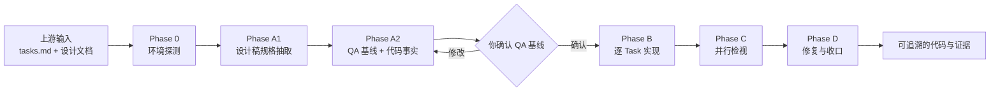

# sdd-dev-frontend 使用说明

> 本文是项目级维护与使用说明，不属于 Skill 运行时上下文。运行时行为以 [`SKILL.md`](../../../skills/sdd-dev-frontend/SKILL.md) 为准。

`sdd-dev-frontend` 用于把上游已经拆好的**一个前端 Story**，从 `tasks.md` 执行成可验收的前端代码、测试结果、机器还原报告、按需视觉证据和检视结论。

从使用者的角度，可以把它理解成一条带验收门禁的开发流水线：



它不只关注“代码有没有写完”，还会在开工前冻结“怎样才算做完”，在实现中保留 RED → GREEN 证据，并在结束前检查布局、代码规范、工程质量、功能和回归。

## 适合什么时候用

以下条件同时成立时，适合使用本 skill：

- `sdd-task` 已为当前 Story 产出 `tasks.md`（没有时，只要已在当前会话中把 Story 范围、AC、还原基线和对接模式聊清楚，Phase 0 也会自动起草一份，见 [团队起步套件.md](./团队起步套件.md)）；
- `tasks.md` 标明目标仓是 frontend；
- 目标前端仓可以访问；
- 至少有一种还原基线：
  1. HTML 原型；
  2. 仓内可类比的已上线页面；
  3. `story-delta-frontend-design.md` 中可直接落地的文字规格。

一次运行只处理：

> **一个独立前端 app × 一个 Story 的 `tasks.md`**

如果一个需求涉及多个 Story、多个 app 或多个仓，请分别运行；跨 app / 跨仓依赖由外层流程协调。

以下情况不应直接使用：

| 当前情况 | 应先做什么 |
| --- | --- |
| 还没有 `tasks.md` | 有 `sdd-task` 就先运行它；没有时，若已在会话中把需求聊清楚可直接调用（Phase 0 会自动判断能否起草），否则见 [团队起步套件.md](./团队起步套件.md) 先手写最小合规版本 |
| 需要修改设计方案，而不是执行现有设计 | 回到 `sdd-design` |
| 是纯后端 Story | 使用对应的后端开发流程 |
| 想在一次运行里覆盖多个仓或多个 Story | 拆成多个独立运行 |

## 开始前要准备什么

### 必需输入

| 文件或目录 | 典型位置 | 作用 |
| --- | --- | --- |
| `tasks.md` | `<story-dir>/tasks.md` | 唯一执行清单，也是唯一进度真相；缺失且会话内容足够时由 Phase 0 自动起草 |
| `alpha-tests.md` | `<story-dir>/alpha-tests.md` | RED / GREEN 与 AC 证据账本 |
| `story-delta-frontend-design.md` | `<story-dir>/story-delta-frontend-design.md` | 当前 Story 的前端增量设计 |
| 目标前端仓 | `<repo-root>` | 实际修改代码、运行测试和启动页面的工程 |

### 推荐输入

| 文件或目录 | 典型位置 | 缺失时会怎样 |
| --- | --- | --- |
| HTML 原型 | `<prototype-dir>` | 改用参照页或文字规格，证据可信度会降级 |
| `requirement-frontend-design.md` | `<requirement-dir>/requirement-frontend-design.md` | 共享组件与对接模式会记为已知缺口 |
| Test Design 用例 | 上游文档引用的位置 | F1 层级对账改用仓内测试命令补证 |

`tasks.md` 最好已经遵循这两项前端约定：

- 还原类工作的 Step ① 运行冻结的外部设计契约，以机器报告中的明确 RED 作为失败证据；
- 前端 Task 优先按“还原 / 逻辑”形态切分，页面样式集中在还原 Task。

即使没有遵循，skill 也会继续执行，但不会修改 `tasks.md` 的内容；它会退回到“一个 Task 内多轮 6 步”的方式，取证成本通常更高。

## 如何调用

### 最简调用

当目录结构清晰、路径能自动定位时，可以直接说：

```text
请使用 sdd-dev-frontend 执行 Story FE-123。
按该 Story 的 tasks.md 完成前端实现、证据记录、并行检视和收口。
```

### 推荐调用

明确给出路径，可以减少首次定位时的来回确认：

```text
请使用 sdd-dev-frontend 执行订单列表 Story。

目标前端仓：/workspace/apps/order-web
Story 目录：/workspace/specs/order-management/stories/ST-03
Requirement 目录：/workspace/specs/order-management
HTML 原型目录：/workspace/specs/order-management/prototypes

请按 tasks.md 原顺序执行；QA 基线产出后先让我确认，再进入实现。
```

不需要另行要求“保留证据”或“做 review”，它们本来就是完整流程的一部分。

### 没有 HTML 原型时

可以直接说明希望使用哪种基线：

```text
请使用 sdd-dev-frontend 执行 ST-03。
本 Story 没有 HTML 原型，请先勘察仓内同类列表页，给出 2–3 个参照页候选，
把最终基线源并入 Phase A 确认门，由我确认后再实现。
```

或者：

```text
请使用 sdd-dev-frontend 执行 ST-03。
本 Story 不产出 HTML 原型，按 story-delta-frontend-design.md 的文字规格
和仓内 token 执行，并显式标记证据降级。
```

## 你会在哪些时刻被打断

流程会尽量自动推进。通常只有以下情况需要你参与：

| 时刻 | 你需要做什么 |
| --- | --- |
| 仓库首次接入需要下载、秘密、登录或外部数据 | 完成一次授权或登录；随后自动返回当前 Story |
| 路径无法唯一定位 | 一次性确认缺失或冲突的路径 |
| 基线中存在无法由仓库事实回答的设计决策 | 批量回答必须由人决定的问题 |
| Phase A 完成 | 确认 QA 基线；这是进入实现前的硬门禁 |
| 同一报错连续修 3 次不成 | 决定是否扩大改动范围或调整方案 |
| 必须修改当前 Task 文件清单以外的文件 | 明确授权或拒绝越界改动 |
| Phase D 存在阻断项、Open Question 或 Deferred 候选 | 决定处理方式或外部依赖归属 |
| 全部完成 | 接收最终三行索引和 `acceptance.md` 路径 |

最重要的一次交互是 **Phase A 确认门**。你确认的是具体、可判定的 QA 基线，而不是一句“按原型实现”。确认后基线会被冻结；后续如果要放宽任何标准，必须登记变更并再次请你确认。

## 完整流程与每一步的交接产物

### Phase -1：仓库接入门

先把旧版 `routing.md` / `styling.md` / `testing.md` 原位迁成 `routes.md` / `styles.md` / `tests.md`，再走一道极轻的门：当前 app baseline 的 `index.md` 在不在、`structure.md` 的栈签名读不读得出一个具名的框架加一个具名的形态。不在或读不出时自动路由 `sdd-init-frontend`，主动完成依赖、配置、服务、登录、fixture 和质量命令准备，再返回当前 Story。命名归一后不按份数查——`组件库` 形态下 `routes.md` 与 `api.md` 本就不该存在。单条结论不成立不是就绪问题，读到时就地修。

当前 app 的 baseline 保存在 `<frontend-root>/frontend-baselines/`，不会每个 Story 重抽。单应用仓的 `<frontend-root>` 就是仓根；monorepo 由 Story 的 `search_paths` 与前端设计定位到一个 app 根。

### Phase 0：需求执行起点

这一阶段回答“这个 Story 从什么提交、什么场景和什么失败集合开始”。

`<story-dir>` 下没有 `tasks.md` 时，本阶段第一件事是判断能不能自动起草：当前会话已经把 Story 范围、AC、还原基线和对接模式聊清楚就直接起草并请你确认（模板见 [团队起步套件.md](./团队起步套件.md)）；聊得不够就先问缺口，不替你编。

主要检查：

1. Story 范围、目标路由、`base-ref`、起点 SHA 和工作区状态；
2. 本次账号、角色、租户、fixture 与 API/mock 模式；
3. 目标路由、截图和结构化采集当前是否可用；
4. test / typecheck / lint / build 在开工起点的具体失败集合；
5. 原型是格式化 HTML 还是单行导出件；资源完整性由 A1 抽取。

**交接产物**

| 产物 | 写入位置 | 交给下一步什么信息 |
| --- | --- | --- |
| `dev-baseline.md` 的“执行起点（环境）” | `<story-dir>/dev-baseline.md` | app baseline 引用、场景、`base-ref`、质量失败集合、页面/采集能力和 Story 特有限制 |

起点失败集合非常关键：后续回归不是要求仓库“从此全绿”，而是要求本 Story 不引入起点之外的新失败。

页面能力与截图能力分开判定：

- 页面可用但不能截图：结构化渲染仍可判定机器可检规则；只有 visual 规则保持 YELLOW。
- 页面不可用：只执行静态预检；依赖计算样式、几何、真实状态和视觉的规则保持 YELLOW。

不会用源码阅读冒充浏览器实测，也不会把未验证维度写成 GREEN。

### Phase A1：设计稿规格抽取

这一阶段把 HTML 原型中的事实搬成结构化规格。完成后，后续实现以区块规格为入口，不需要反复通读整份原型。

处理顺序：

1. 脚本抽取 design tokens、界面模式、文案分类和 `design-facts.json`；
2. 将页面划分为“一屏可截、一个名词短语说得清”的区块；
3. 为每个区块生成独立规格；
4. 用内容哈希判断已有规格能否复用，只重抽变化或新增的区块。

**交接产物**

| 产物 | 写入位置 | 下游如何使用 |
| --- | --- | --- |
| `design-tokens.md` | `<design-spec-dir>/` | 提供设计稿侧共享颜色、间距、字号等事实 |
| `interface-inventory.md` | `<design-spec-dir>/` | 提供重复界面模式、`IC-nn` 编号、名称和变体关系 |
| `content-inventory.md` | `<design-spec-dir>/` | 区分静态标签与动态数据位，避免把样例数据当成固定文案 |
| `design-facts.json` | `<design-spec-dir>/` | 提供结构、静态文案、token、布局声明、资源内容/缺失状态和完整原型指纹 |
| `block-index.md` | `<design-spec-dir>/` | 页面 → 区块切分表，记录锚点与内容哈希 |
| `blocks/<区块名>.md` | `<design-spec-dir>/blocks/` | 当前区块的组件引用、token、布局值、文案、资源和 R1–R6 规格 |

`<design-spec-dir>` 恒为：

```text
<requirement-dir>/design-spec/
```

这些是 **Requirement 级设计事实**，可以被同一 Requirement 下的其他 Story 复用。它们不写进代码仓，也不随单个 Story 的代码提交进入 PR。

如果基线源不是 HTML 原型，而是参照页或文字规格，整个 A1 会跳过。

### Phase A2：规格与代码勘察

这一阶段形成两份互补的开工输入：

- 规格侧回答“怎样才算做完”；
- 代码侧回答“这个仓本来应该怎么写”。

正常情况下两路并行：

| 勘察方向 | 关注内容 | 产物 |
| --- | --- | --- |
| 规格侧 | Story 功能理解、还原侧 R1–R6、功能侧 F1–F4、豁免、已知缺口 | `dev-baseline.md` |
| 代码侧 | 当前 Story 应采用的 Requirement 决策与仓库 `PATTERN-*` | 并入 `dev-baseline.md / 工程依据`，只保存引用 |

**交接产物**

| 产物 | 写入位置 | 交给下一步什么信息 |
| --- | --- | --- |
| 完整 `dev-baseline.md` | `<story-dir>/dev-baseline.md` | 已确认的 QA 基线、豁免、环境能力，以及 `PATTERN-*` / `REQ-DEC-*` 工程依据引用 |

QA 基线的分类法固定为下面十个维度，不能增删；但它们是**候选分类**，每个 Story 只生成 AC、设计输入或风险触发器实际要求的行，不适用的分类直接省略：

| 还原侧 | 功能侧 |
| --- | --- |
| R1 区块与层级完整性 | F1 AC ↔ 测试层级映射 |
| R2 文案一致性 | F2 每条 AC 的可观察判定 |
| R3 间距与对齐 | F3 异常与边界分支 |
| R4 状态样式 | F4 数据与接口契约 |
| R5 空态与边界内容 |  |
| R6 指定视口下的布局完整性 |  |

这一阶段最后会展示 QA 基线全文和豁免表，请你确认。确认后，`dev-baseline.md` 冻结，并编译 Story 级 `restore-contract.json`。契约保存基线哈希，后续每次运行先校验一致性；实现定位另存 `restore-adapter.json`，优先级固定为 role/name → 精确文案 → 稳定 test id → CSS：

```text
冻结状态：已冻结 ✅
```

未确认不能进入 Phase B。

### 样式还原：先确定 Task 归属，再执行还原轮

这里的“样式还原”首先是一种 **Task 切分与文件归属规则**，不只是“在某个 Task 里跑一次还原轮”。推荐的 `tasks.md` 顺序是：

```text
公共样式与骨架 Task（多页面共享时才需要）
                  ↓
页面还原 Task（默认每个页面一个）
                  ↓
逻辑 Task × N（按 AC 分组）
```

| Task 类型 | 负责什么 | 完成后交接什么 |
| --- | --- | --- |
| 公共样式与骨架 Task | 新增或修改 token、公共布局组件、跨页复用的展示组件 | 稳定的公共视觉底座，供所有页面还原 Task 使用 |
| 页面还原 Task | 一次落完页面全部区块的静态结构与样式，包括 hover / focus / disabled / 选中 / loading、空态和边界内容的静态呈现 | 页面骨架与样式文件；RED / GREEN 机器报告；按需视觉证据；`alpha-tests.md` 中的 `R-<Task>-<轮次>` 记录 |
| 逻辑 Task | 按 AC 接入状态迁移、条件渲染、数据变换和接口交互 | 逻辑代码、测试和 L4 / L3 证据；原则上不再改样式文件 |

这种切法的目的，是让页面还原 Task 的冻结契约能够整体 GREEN，并让后续逻辑 Task 不再推翻已 GREEN 的机器证据。

#### 使用者应在 `tasks.md` 中检查什么

1. **共享内容先落地。** 多个页面共用布局骨架、展示组件或新 token 时，应先有一个公共样式与骨架 Task，并排在全部页面 Task 之前。
2. **一个页面默认一个还原 Task。** 只有在原型分散于多个文件，或区块多到一轮冻结契约无法完成时，才按区块边界拆分；不得拆成“先骨架、后细化样式”两遍。
3. **区块要能独立取证。** 每个区块都应注明原型文件与稳定 class 锚点，有单一视觉职责，并能由一组 R1–R6 契约规则完整覆盖。
4. **还原 Task 独占样式文件。** 页面样式和组件骨架文件应列在还原 Task；逻辑 Task 的文件清单不应包含样式文件。
5. **没有收尾样式 Task。** 不应出现“样式微调”“统一优化样式”“视觉走查修复”等 Task；偏差必须在所属区块的还原轮当轮让同一契约无 RED、无 YELLOW。

逻辑 Task 确实必须改样式时，应在该 Task 下显式登记：

```text
越界改样式：<文件> — <原因>
影响证据：<被影响的还原 Task / R-记录编号>
```

这意味着对应的还原证据已经失效，相关区块必须重跑同一冻结契约，不能沿用之前的 GREEN 结论。

#### 上游没有这样切时

本 skill 只执行现有 `tasks.md`，不会回头改写它。若上游仍按功能点切分、多个 Task 都带一点样式，执行时会退回到“一个 Task 内多轮 6 步”，固定先还原轮、后逻辑轮。它仍能执行，但同一区块会被反复运行契约，后续改样式也可能使早先的 GREEN 报告失效。

> 样式还原发生在 Phase B，目标是让当前区块的冻结外部契约无 RED、无 YELLOW；Phase C 的布局与响应式检视保持现有流程，仍是完成后的只读复核，关注跨页一致性、真实数据、多视口和交互态，不能代替还原 Task，也不能成为延后修样式的出口。

### Phase B：逐 Task 实现

主 agent 按 `tasks.md` 原顺序执行，不重排 Task。每个 Task 动手前先读 `dev-baseline.md / 工程依据`，按 ID 回读当前 app baseline 里那条唯一正文，优先复用 app 内已有 token、方法、hooks、请求封装和代码规范。

上游已按形态切分时，页面还原 Task 只跑还原轮，后续逻辑 Task 只跑逻辑轮。只有上游没有切开，或样式确实由运行时状态计算、没有独立静态形态时，一个 Task 才包含多轮 6 步；顺序固定为先还原、后逻辑。

| Step | 逻辑轮 | 还原轮 |
| --- | --- | --- |
| ① RED | 写失败的单元测试或接口集成测试 | 校验并运行同一冻结契约，生成三色报告；至少一项明确 RED 才进入实现 |
| ② 验 RED | 运行测试，确认按预期失败 | 核对 RED 的外部出处和实现定位；YELLOW 先补结构化证据，仍无法判定才按需截图 |
| ③ GREEN | 最小实现让测试转绿 | 只改机器报告中的 RED 项 |
| ④ 验 GREEN | 测试转绿，并对照 Phase 0 做全量回归 | 重跑同一契约；无 RED、无 YELLOW，且回归无退化 |
| ⑤ REFACTOR | 按需重构 | 按需重构，之后重跑同一契约 |
| ⑥ 记录并提交 | 证据写入 L4 / L3 记录 | 契约哈希、RED / GREEN 报告路径与指纹、摘要、可选视觉缓存/截图写入还原证据记录 |

**交接产物**

| 产物 | 写入位置 | 交给下一步什么信息 |
| --- | --- | --- |
| 实现代码与测试 | `<repo-root>` | 当前 Story 的实际代码改动 |
| 已勾选的 `tasks.md` | `<story-dir>/tasks.md` | 唯一进度真相；中断后从第一个未完成 Task 继续 |
| 扩容后的 `alpha-tests.md` | `<story-dir>/alpha-tests.md` | L4 / L3 / 还原证据与 AC ↔ 证据映射 |
| `restore-contract.json` / `restore-adapter.json` | `<story-dir>/` | 冻结 R1–R6 机器规则与实现定位 |
| `restore-report-red.json` / `restore-report-green.json` | `<story-dir>/` | 同一契约在实现前后的三色结果 |
| 按需实现截图 | `<story-dir>/evidence/<Task>-r<轮次>/` | 仅供机器无法可靠判断的 visual 规则补证 |

还原轮中的“差异清单”只是机器报告的人类摘要。Step ⑥ 只把契约与报告的指纹、路径、摘要和可选视觉证据写进 `alpha-tests.md`；它始终是 AC 证据追溯的唯一账本。

本阶段有三条保护边界：

- 修复动作不超出当前 Task 的文件清单；
- 不使用无理由的 `any`、`@ts-ignore`、`eslint-disable` 绕过问题；
- 同一报错连续修 3 次不成就停止并向你升级。

### Phase C：并行检视

全部 Task GREEN、证据完整、QA 基线已冻结后，才进入检视。

派哪几路由本次验证组合决定，**不是每个 Story 都跑满**：没触发的角色不派、也不生成占位结果。每一路检查什么、怎么定级，全部来自 [`sdd-review-frontend`](../../../skills/sdd-review-frontend/SKILL.md)；本 skill 只负责选角色、备证据和汇总。

每条结论只有两级：

- **阻断级**：必须修复后才能收口；
- **建议级**：进入报告，但不阻断收口。

Open Question 与 Deferred 候选单独列出，不混进这两级。

**交接产物**

| 产物 | 写入位置 | 交给下一步什么信息 |
| --- | --- | --- |
| `acceptance.md` | `<story-dir>/acceptance.md` | 各路检视的执行状态、阻断级、建议级、Open Question、Deferred 候选 |
| 检视截图 | `<story-dir>/evidence/review/` | 被报告引用的布局与功能证据 |

如果某份检视因为已知环境限制无法执行，它不会被静默跳过：执行状态、收口结论和最终状态都会显式注明。

### Phase D：修复、复跑与收口

这一阶段把阻断级结论清零，并把最终状态回填到证据账本。

处理方式：

1. 主 agent 按编号逐条修复确证的阻断级；
2. 修复后按依赖精确失效：只作废依赖被改文件的证据与判断，未受影响的继续复用；
3. 同一阻断连续三次修不掉、需要越界改动、或会改变冻结期望时停下；
4. 仍修不掉、存在 Open Question 或 Deferred 待判时，一次性向你提问；
5. 所有门禁通过后，才宣告完成。

**交接产物**

| 产物 | 最终更新内容 |
| --- | --- |
| `acceptance.md` | 阻断项的修复状态、复跑结论、各路检视状态、未验收项 |
| `alpha-tests.md` | 功能自测试实测结果、AC 最终状态、Deferred 原因与解除条件 |
| `dev-baseline.md` | 如收口期间调整过基线，保留变更记录和再次确认结果 |
| `<story-dir>/evidence/review/` | 最终报告引用的可复核截图 |

完成时你会看到三行索引：

```text
✓ sdd-dev-frontend 完成
产出：<story-dir>/acceptance.md
下一步：<按当前状态给出的唯一动作>
```

如果存在降级、未执行检视或 Deferred，第一行会带状态限定，不会伪装成全部通过。

## 产物之间如何交接

可以从下面这张表快速判断“某个文件是谁产出的、下游拿它做什么”。

| 产物 | 生命周期 | 生产阶段 | 主要消费者 |
| --- | --- | --- | --- |
| `<frontend-root>/frontend-baselines/` 九份按问句 baseline | app 级 | Phase -1 / `sdd-init-frontend` | 该 app 的所有 Requirement / Story |
| `design-spec/design-tokens.md` | Requirement 级 | A1 | 区块规格抽取、QA 基线 |
| `design-spec/interface-inventory.md` | Requirement 级 | A1 | 区块规格抽取 |
| `design-spec/content-inventory.md` | Requirement 级 | A1 | 静态标签 / 动态数据位判定 |
| `design-spec/design-facts.json` | Requirement 级 | A1 | 冻结契约的结构、文案、token、布局和资源事实 |
| `design-spec/block-index.md` | Requirement 级 | A1 | QA 基线、还原轮、证据定位 |
| `design-spec/blocks/*.md` | Requirement 级 | A1 | QA 基线与还原轮的设计取值入口 |
| `design-spec/visual-baseline/<fingerprint>/` | Requirement 级 | B 按需 | visual YELLOW 的只读原型缓存 |
| `dev-baseline.md` | Story 级 | Phase 0 + A2 | Phase B 实现、Phase C 检视、Phase D 收口 |
| `restore-contract.json` | Story 级 | A2 | Phase B 固定机器判定规则 |
| `restore-adapter.json` | Story 级 | A2 + B | 将实现元素映射到契约规则 |
| `restore-report-*.json` | Story 级 | B | RED / GREEN 机器结果 |
| `tasks.md` checkbox | Story 级 | B | 失败恢复、Phase C 前置检查 |
| `alpha-tests.md` | Story 级 | B + D | AC 证据追溯、功能自测试、最终验收 |
| `acceptance.md` | Story 级 | C + D | 最终收口与使用者验收 |
| `evidence/` | Story 级 | B + C | 视觉还原与检视证据 |

典型目录布局：

```text
<frontend-root>/frontend-baselines/
├── index.md
├── structure.md / runtime.md / components.md / routes.md
└── api.md / data.md / styles.md / tests.md

<requirement-dir>/
├── requirement-frontend-design.md
├── design-spec/                         # Requirement 级设计事实
│   ├── design-tokens.md
│   ├── interface-inventory.md
│   ├── content-inventory.md
│   ├── design-facts.json
│   ├── block-index.md
│   ├── visual-baseline/
│   │   └── <fingerprint>/
│   │       ├── prototype.png
│   │       └── manifest.json
│   └── blocks/
│       └── <区块名>.md
└── <story-dir>/
    ├── tasks.md
    ├── alpha-tests.md
    ├── story-delta-frontend-design.md
    ├── dev-baseline.md
    ├── restore-contract.json
    ├── restore-adapter.json
    ├── restore-report-red.json
    ├── restore-report-green.json
    ├── acceptance.md
    └── evidence/
        ├── <Task>-r<轮次>/
        └── review/

<repo-root>/                              # 只放实际前端代码与测试
```

## 怎样判断是否真的完成

“代码能编译”不是本 skill 的完成条件。至少要同时满足：

- `tasks.md` 的 6 步 checkbox 全部完成；
- 每个还原轮的最终机器报告都无 RED、无 YELLOW；未实际匹配项逐条命中冻结豁免；
- `acceptance.md` 的阻断级为 0；
- 没有 AC 未覆盖、占位实现、类型错误、调试语句或无理由的类型逃逸；
- test / typecheck / lint / build 相对 `DEMAND-2` 起点没有变差；
- `alpha-tests.md` 中每条 AC 都有可追溯证据与状态；
- `Deferred` 没有被算成已验收；
- 未执行的检视已显式披露。

其中：

> **Deferred 表示“外部依赖未就绪，本次尚未验收”，不是通过，也不是豁免。**

## 常见降级场景

| 场景 | skill 会怎么处理 | 对最终结果的影响 |
| --- | --- | --- |
| 没有 HTML 原型，但有同类参照页 | 先给出参照页候选，由你在确认门选择 | 还原基线为类比基线，可信度降级 |
| 既无原型也无参照页 | 使用文字规格 + 仓内 token | 无视觉基线，只承诺文字规格、token 一致性和“不破” |
| 无截图能力 | static / render 正常执行；visual 规则保持 YELLOW | 机器可检项不受影响；未补齐 visual 前还原轮不能 GREEN |
| 页面无法启动 | 只执行 static；render-required 与 visual 规则保持 YELLOW | 结构、计算样式、几何和实际状态未验证，不能伪装成 GREEN |
| 接口不可用 | 相关功能项记为未跑，主 agent 判断 Deferred | 对应 AC 不计为已验收 |
| 缺 `DEMAND-2` 起点失败集合 | 无法判断回归是否变差 | 不得把“回归未变差”判为通过 |
| 原型资源缺失 | 原型侧缺失的图标不参与 R1 差异判定 | 资源缺口与影响进入 `DEMAND-1` 和证据 |

降级只改变证据强度或可执行范围，不会偷偷放宽已经确认的 QA 基线。

## 中断后如何继续

直接说：

```text
请继续运行 sdd-dev-frontend，从上次中断的位置接着做。
```

恢复规则：

- `tasks.md` checkbox 是唯一进度真相，从第一个未完成 Task 继续；
- `alpha-tests.md` 中已有的 RED / GREEN 报告引用不会被无故覆盖；
- Story 未变化时复用 `dev-baseline.md` 的工程依据；仓库规范有变动时只重选 ID，不复制正文；
- 已冻结且内容未变的 QA 基线不会要求你重复确认；
- 设计规格按区块内容哈希复用；原型指纹覆盖 DOM/CSS 与资源内容/缺失状态，视觉缓存按完整环境键只读复用；
- `acceptance.md` 的检视结论按依赖失效：代码变化只作废依赖被改文件的那部分，未受影响的继续复用。

如果上游修改了 `tasks.md` 或 Story 设计文档，视为 Story 已变化：勘察、QA 基线和确认门都需要重来。

## 只重跑某一个步骤

完整流程之外，也可以用自然语言触发单步入口：

| 你可以这样说 | 会执行什么 |
| --- | --- |
| “重抽设计稿规格” | 重跑 A1；哈希一致的区块仍然复用 |
| “订单筛选栏的区块规格重来一份” | 只重抽该区块，不动其他区块 |
| “只做勘察” | 规格侧与代码侧勘察 |
| “只做规格侧勘察” | 重出 QA 基线 |
| “只做代码侧勘察” | 重出代码事实 |
| “重跑还原契约” | 校验基线哈希，重跑 static / render / 按需 visual，更新同阶段报告 |
| “补还原 YELLOW” | 按 `required_evidence` 补页面、状态 fixture、结构化采集或最后的视觉证据 |
| “重跑布局检视” | 只更新 `acceptance.md` 的布局检视部分 |
| “重跑代码规范检视” | 只更新代码规范检视部分 |
| “重跑质量检视” | 只更新质量检视部分 |
| “只跑功能自测试” | 只更新功能自测试结果 |
| “重跑全部检视”或“重新收口” | 按当前验证组合重新派出全部适用检视，再进入 Phase D |

单步入口不会绕过前置条件。例如 QA 基线未冻结时，不能直接运行功能自测试；单跑一份检视也不等于整个 Story 已完成。

## 使用建议

- 路径明确时，在首次调用中直接提供 `<repo-root>`、`<story-dir>`、`<requirement-dir>` 和 `<prototype-dir>`。
- 开工前先看 `tasks.md` 的样式归属：公共样式与骨架是否在前、每个页面是否有还原 Task、逻辑 Task 是否避开样式文件。
- 认真审阅 Phase A 的 QA 基线。它是后续所有 RED / GREEN、检视分级和收口判断的共同依据。
- 不要把“接口还没好”写成豁免；应使用 Deferred，并提供可观察的解除条件。
- 如果要改变响应式布局结构，先补上游规格。上游没有响应式规格时，本 skill 只承诺“不破”：无横向滚动、无重叠、无内容截断。
- 验收时先看 `acceptance.md`，再沿其中的路径追到 `dev-baseline.md`、`restore-contract.json`、机器报告与 `alpha-tests.md`；只有报告引用 visual 项时才查看截图。

## 进一步阅读

- [团队起步套件.md](./团队起步套件.md)：没有 `sdd-task` / `sdd-design` 时，如何手写最小合规产物快速试跑
- [背景介绍.md](./背景介绍.md)：框架形成时的项目与流程背景
- [SKILL.md](../../../skills/sdd-dev-frontend/SKILL.md)：完整编排规则、硬门禁和失败处理
- [前端 SDD 执行契约](../../../skills/sdd-dev-frontend/references/execution-contract.md)：跨 Skill 的所有权、状态与 TaskPacket 语义
- [方案设计.md](./方案设计.md)：设计取舍与流程蓝图
- [样式还原验证改造计划.md](./样式还原验证改造计划.md)：V2 契约化还原的已实施计划
- [ADR](./adr/)：关键架构决策记录
- [QA 基线模板](../../../skills/sdd-dev-frontend/references/templates/qa-baseline.md)：十个固定维度
- [前端 Task 切分与步骤形状](../../../skills/sdd-dev-frontend/references/execution-contract.md#task-切分与步骤形状)：还原 Task、样式文件归属与计划边界
- [还原契约怎么写](../../../skills/sdd-dev-frontend/references/restore/contract.md) 与 [怎么跑](../../../skills/sdd-dev-frontend/references/restore/run.md)：JSON 工件与规则字段，以及命令和三色语义
- [Story 工件模板](../../../skills/sdd-dev-frontend/references/templates/story-artifacts.md)：`dev-baseline.md` / `alpha-tests.md` / `acceptance.md` 的形状，含还原证据和 AC 映射
- [检视派发](../../../skills/sdd-dev-frontend/references/review/dispatch.md)：派哪几格、角色 ↔ lens 映射与请求参数包；检查项、定级与回传契约都在 [`sdd-review-frontend`](../../../skills/sdd-review-frontend/SKILL.md)
