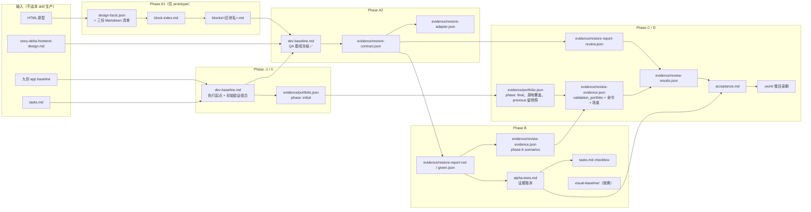

# sdd-dev-frontend 产物清单

> 本文是项目级维护文档，不属于 Skill 运行时上下文。每个产物的字段形状以其模板或脚本 schema 为唯一事实源，本文只回答四个问题：**这个产物为什么存在、拿它做什么、什么时候生产与消费、看它时要盯住什么**，并把每个产物对应的模板与脚本挂在同一张卡片上。

运行时事实源：[`SKILL.md`](../../../skills/sdd-dev-frontend/SKILL.md)（工件管理、硬门禁、退出门禁）、[`execution-contract.md`](../../../skills/sdd-dev-frontend/references/execution-contract.md)（所有权与状态）、`references/` 下各阶段细则与模板、`scripts/` 下六个脚本。文中「§」引用指这些文件的章节。

---

## 一、总览

### 1.1 三个层级加一类过程件

产物按**谁拥有、活多久**分层。层级决定它写在哪个目录、谁能改、什么时候会被推翻。

| 层级 | 目录 | 所有者 | 生命周期 | 本 skill 的权限 |
| --- | --- | --- | --- | --- |
| app 级 | `<frontend-root>/frontend-baselines/` | `sdd-init-frontend` | 跨 Requirement | 只读；清单条目指路失效可就地修单条，规范节不可改 |
| Requirement 级 | `<requirement-dir>/design-spec/` | 本 skill Phase A1 | 同一 Requirement 下所有 Story 复用 | 按原型 / 区块内容哈希增量重写；`visual-baseline/` 下原型指纹已失配的缓存在下一次 A1 删 |
| Story 级 · 给人读 | `<story-dir>/` 根 | 本 skill（`tasks.md` 除外） | 一个 Story | 生产、回填、聚合；只放 Markdown |
| Story 级 · 机器件 | `<evidence-dir>` = `<story-dir>/evidence/` | 本 skill | 一个 Story | 全部 JSON 与被引用的截图；`acceptance.md` 指路进来 |
| 过程件 | `<work-dir>` = `<story-dir>/.work/` | 本 skill | 一个阶段 | Phase D 退出门禁通过后整目录删；中断续跑期间保留 |
| 子代理回传正文 | 不落盘 | 子代理 | 一次调用 | 由主 agent 校验后写进上面三层 |

Story 目录只分两层，判据是「验收的人要不要主动打开它」，不是「哪条流水线产的」：

```text
<story-dir>/
├── tasks.md · story-delta-frontend-design.md   上游：做什么、怎么设计
├── dev-baseline.md                             怎样算做完（Phase A 冻结的标准）
├── alpha-tests.md                              做到哪了（证据账本）
├── acceptance.md                               能不能验收（收口入口）
├── evidence/                                   机器件
│   ├── restore-contract.json · restore-adapter.json
│   ├── restore-report-red.json · restore-report-green.json · restore-report-review.json
│   ├── portfolio.json · review-evidence.json · review-results.json
│   └── artifacts/                              被结论引用的截图与结构化结果
└── .work/                                      过程件；Phase D 退出后整目录删
```

过程件的清理规则只有一条：**它们全部能从正式工件与代码重算，所以 Phase D 退出门禁全部通过后整目录删，门禁没过就不删**。哪些文件算过程件、各自被谁消费、并入了哪份正式工件，见 §2.6。`tests/check-consistency.mjs` 的 `fe-story-layout` 机械守住这条边界：运行时文件里不许再出现 `<story-dir>/*.json` 或「临时目录」。

### 1.2 产物在流程中的位置



### 1.3 总表：产物 × 阶段 × 模板 × 脚本

| 产物 | 层级 | 生产阶段 / 生产者 | 主要消费者 | 模板（形状事实源） | 脚本 |
| --- | --- | --- | --- | --- | --- |
| `design-facts.json` | Requirement | A1 / `extract_design_spec.py extract` | `extract-block-spec`、`recon-spec`、还原契约 `design_fact_source`、视觉缓存键 | schema 即代码 | `extract_design_spec.py` |
| `design-tokens.md` / `interface-inventory.md` / `content-inventory.md` | Requirement | A1 / 同上；`interface-inventory.md` 的「组件命名审订」节由 `extract-prototype` 回传 | `extract-prototype`、`extract-block-spec`、`recon-spec` | 渲染器即代码 | `extract_design_spec.py` |
| `block-index.md` | Requirement | A1 / `extract-prototype`（小稿由主 agent 直通道） | `extract-block-spec`、`recon-spec`（区块名逐字沿用） | `agents/extract-prototype.md` §四 | `extract_design_spec.py block / blocks` |
| `blocks/<区块名>.md` | Requirement | A1 / `extract-block-spec` | `recon-spec`（第 1 档期望值来源） | `references/templates/block-spec.md` | `extract_design_spec.py block` 产切片 |
| `visual-baseline/<缓存指纹>/` | Requirement | B 按需 / 主 agent + 浏览器驱动 | visual YELLOW 的人工对照 | `manifest.json` 键即代码 | `extract_design_spec.py visual-cache` |
| `tasks.md` | Story · 给人读 | 上游 `sdd-task-frontend`；本 skill 只勾 checkbox；Phase 0 可起草 | 全阶段；`compile_portfolio.py`、`aggregate --tasks` | `../sdd-task-frontend/templates/tasks-frontend.md` | `compile_portfolio.py` 读 TaskPacket 与「用例追溯」 |
| `story-delta-frontend-design.md` | Story · 给人读 | 上游；Phase 0 缺失时起草骨架 | `recon-spec`（第 3 档文字规格）、`contract` 档事实源 | `story-artifacts.md` §四 | — |
| `dev-baseline.md` | Story · 给人读 | Phase 0 写执行起点；A2 追加并冻结 QA 基线；C 更新验证组合 | B 每个 Task 开工前、C 派发约束、`verify_restore_contract.py` 哈希锁 | `story-artifacts.md` §一 + `qa-baseline.md` | `compile_portfolio.py --markdown`；`verify_restore_contract.py contract` 锁哈希 |
| `evidence/portfolio.json` | Story · 机器件 | Phase 0 写 initial；Phase C 以同一文件为 `--previous` 原地覆盖成 final | `review-evidence.json / validation_portfolio`、`aggregate` 对账 | schema 即代码 | `compile_portfolio.py` + `portfolio-rules.json` |
| `evidence/restore-contract.json` | Story · 机器件 | A2 冻结后 / 主 agent 编译 `recon-spec` 的规则草稿 | B 还原轮、C `review-restore` | `references/restore/contract.md` | `verify_restore_contract.py contract / validate` |
| `evidence/restore-adapter.json` | Story · 机器件 | A2 / 主 agent 写实现 locator | `static` / `report` / 浏览器采集 | `restore/contract.md` §三 | `verify_restore_contract.py validate`；`collect_restore_facts.js` 读 |
| `evidence/restore-report-red.json` / `-green.json` / `-review.json` | Story · 机器件 | B Step ① / B 转绿 / C 派发前 | `alpha-tests.md` 还原证据记录、`review-restore` | `restore/run.md` §三 | `verify_restore_contract.py report`；`collect_restore_facts.js` 采 |
| `alpha-tests.md` | Story · 给人读 | 上游给骨架；B 每 Task 末步回填；C/D 更新；解除 DEFERRED 时改状态 | 退出门禁；`aggregate --alpha-tests` 直读三张表 | `story-artifacts.md` §二 | `manage_review_pipeline.py aggregate`（解析契约）；`verify_restore_contract.py evidence-format`（历史兼容） |
| `evidence/review-evidence.json` | Story · 机器件 | B 就地入包；C 补命令、场景、`validation_portfolio` | 五个检视角色、`aggregate` | `references/review/evidence.md` §二 | `manage_review_pipeline.py scenarios / merge-additions / aggregate` |
| `evidence/review-results.json` | Story · 机器件 | C 生成 / D 更新 | 机器对账、往下追 | schema 即代码 | `manage_review_pipeline.py aggregate --output-json` |
| `evidence/artifacts/` | Story · 机器件 | B / C，被结论引用的截图从 `.work/` 搬入 | scenario `artifacts[]`、visual 项人工对照 | — | `merge-additions` 校验 `evidence_added` |
| `acceptance.md` | Story · 给人读 | C 生成 / D 更新 / 解除 DEFERRED 重渲染 | **人**——验收入口 | `story-artifacts.md` §三（节序说明） | `manage_review_pipeline.py aggregate --output-markdown` |
| `.work/*` | 过程件 | 各阶段 | 同阶段脚本；见 §2.6 | — | Phase D 退出后整目录删 |

---

## 二、逐产物说明

每张卡片五段：背景（没有它会出什么问题）、目的、何时生产、何时使用、关注点；末行给模板与脚本。

### 2.0 输入件：本 skill 读但不生产

| 输入 | 来源 | 本 skill 怎么用 | 关注点 |
| --- | --- | --- | --- |
| 九份 app baseline（`index.md` + `structure.md` / `runtime.md` / `components.md` / `routes.md` / `api.md` / `data.md` / `styles.md` / `tests.md`） | `sdd-init-frontend` | Phase -1 只查 `index.md` 存在、`structure.md` 读得出具名框架 + 形态；Phase 0 / A2 按 `index.md` 场景索引取 `PATTERN-*` / `REQ-DEC-*` ID | 命名归一后**不按份数查**（`组件库` 形态没有 `routes.md` / `api.md` 是正常）；Story 只保存采用的 ID，不复制正文、不记指纹；旧名 `routing.md` / `styling.md` / `testing.md` 出现时先路由 init 迁移 |
| `tasks.md` | `sdd-task-frontend` | 见 2.6 | — |
| `story-delta-frontend-design.md` | 上游设计 | `recon-spec` 第 3 档（文字规格）期望值来源；`contract` 档的接口契约事实源之一 | 缺失时 Phase 0 只在会话事实充分时起草骨架，「未定义 / 待确认」进已知缺口，不补设计 |
| `requirement-frontend-design.md` | 上游设计 | `recon-codebase` 读 `## 工程决策` 选 `REQ-DEC-*` | 可选；缺失记已知缺口 |
| HTML 原型 | `<prototype-dir>` | **只有** `extract_design_spec.py`、`extract-prototype`、`extract-block-spec` 可读（硬门禁 9） | 主 agent、`recon-spec` 与全部检视角色不得打开原型正文；争议只回查一个区块并登记 |

### 2.1 Requirement 级：`<design-spec-dir>` 下的设计事实

只在 `baseline_source=prototype` 时生产；参照页 / 文字规格 / 纯逻辑整段跳过。目录恒为 `<requirement-dir>/design-spec/`，**不得挪进 `<story-dir>`**——挪错会让每个 Story 把同一份设计稿重抽一遍。

#### `design-facts.json`

- **背景**：让 agent 直接读原型 HTML，一份导出件就能把整份稿子灌进上下文，且读出的是「看起来像」的值而不是可复算的事实。需要一个零 LLM、标准库、确定性的中间层，把 DOM/CSS/资源变成能被哈希锁住的 JSON。
- **目的**：Requirement 级确定性原型事实——归一化 DOM 与 CSS、资源存在/缺失状态、区块划分、结构签名、静态文案、token、布局声明，以及覆盖全部内容的 `prototype_fingerprint`。
- **何时生产**：Phase A1 第 1 步 `extract` 落盘；内容不变时不重写（幂等）。
- **何时使用**：`extract-block-spec` 与 `recon-spec` 取期望值；还原契约每条规则的 `design_fact_source` 指向它的锚点与键；视觉缓存键的第一项就是它的原型指纹；直通道（无区块规格）时 `recon-spec` 直接按区块锚点读它。
- **关注点**：退出码 `4`（覆盖缺口）不是崩溃——存在抽取器读不到的样式来源，直接开工会让 R3 / R4 / R6 在区块规格里退化为「未见」。每类缺口先登记进「已知缺口」，再带 `--acknowledge-coverage-gaps` 重跑（硬门禁 14）。单文件接近 2 MB，不进代码仓、不随 PR。
- **模板 / 脚本**：schema 即代码（`extract_design_spec.py` 的 `render_design_facts`）；`extract_design_spec.py extract --out-dir <design-spec-dir>`。

#### `design-tokens.md` / `interface-inventory.md` / `content-inventory.md`

- **背景**：`design-facts.json` 机器可读但人和子代理不便逐条查。三份 Markdown 是它的三个切面：颜色/间距/字号等共享值、重复界面模式、文案分类。
- **目的**：
  - `design-tokens.md`：设计稿侧 token 类与取值（不做仓内映射）。
  - `interface-inventory.md`：重复结构模式 `IC-nn`、实例数、实例锚点、候选段「区块索引」；末尾「组件命名审订（extract-prototype）」节由子代理回传、主 agent 追加。
  - `content-inventory.md`：把文本节点分成**静态标签**与**动态数据位**（占位符）。
- **何时生产**：A1 `extract` 与 `design-facts.json` 一起落盘；文档哈希一致时保留人工命名修订。
- **何时使用**：`extract-prototype` 归并候选段、审订 `IC-nn`；`extract-block-spec` 填「引用组件」「引用 design tokens」「实例数据」；`recon-spec` 直通道时以 `content-inventory.md` 为静态/动态分类入口。
- **关注点**：**动态数据位不得成为 R2 期望值**——实测一份导出件里 `X,XXX个` 出现 220 次；把它逐字写进 R2 等于要求实现把假数据还原到界面上。`IC-nn` 编号由脚本产生，子代理只审名字，不得自造编号。三份文件存在但没有可识别文档哈希时脚本拒绝覆盖。
- **模板 / 脚本**：渲染器即代码（`ARTIFACTS` 元组）；`extract_design_spec.py extract`。

#### `block-index.md`

- **背景**：脚本给出的候选段是机械切分，不一定是「一屏可截、一个名词短语说得清」的视觉区块；QA 基线、还原轮、证据三个阶段要靠同一个区块名认同一个东西。
- **目的**：页面 → 区块切分表：区块名、class 结构锚点、行号坐标（格式化档）、8 位内容哈希、节点数、视觉职责、覆盖的候选段、缓存状态（复用 / 失效 / 新增 / 移除）；附候选段覆盖对账与范围说明。
- **何时生产**：A1 第 3 步。小稿且候选段已是职责单一区块时主 agent 读切片头直接生成（头表标 `切分来源：直通道（脚本切分）`）；需归并或命名审订时派 `extract-prototype`，主 agent 落盘。
- **何时使用**：`extract-block-spec` 逐区块接收锚点与切片；`recon-spec` 还原侧引用的每个区块名必须能在这里找到；缓存判断按「锚点 + 内容哈希」而不是 mtime。
- **关注点**：**最终锚点子树必须完整包含名下全部候选段**——用「代表实例」锚点冒充重复集合，会让其余实例变化时缓存错误命中。切片超过 12,000 字符必须重切，不得留给下游。不跨页面归并。锚点主体是 class 结构，行号只是格式化档的附带坐标，单行导出件写 `-`。
- **模板 / 脚本**：`agents/extract-prototype.md` §四输出格式；`extract_design_spec.py block --anchor` 验证切片、`blocks` 列出锚点与哈希。

#### `blocks/<区块名>.md`（区块规格）

- **背景**：还原轮需要的是「这个区块的元素、文案、尺寸、间距、状态、空态、视口」的可判定陈述，而不是整份原型；一个区块一份、有上限，才能被子代理独立抽取并被缓存。
- **目的**：单区块的引用组件、引用 token、逐元素布局值、静态标签 / 动态数据位、资源与降级、R1–R6 覆盖状态、取证自检。
- **何时生产**：A1 第 4 步，对新增或哈希失配的区块派 `extract-block-spec`，一区块一实例；主 agent 落盘。
- **何时使用**：`recon-spec` 第 1 档把它整理成 R 行与规则草稿；QA 基线「取证方式」列的来源锚点逐字取自区块头。
- **关注点**：正文 ≤ 12,000 字符，超限退回重切，不拆 `part-1/2`。**全文禁止仓内 `PATTERN-*`**（仓内映射留给实现）。R4 / R5 / R6 在静态设计稿里读不到就写「未见」——「未见」是合法结论，不用组件库默认或经验补齐。锚点、行号、内容哈希、原型指纹逐字复制，不自己算。
- **模板 / 脚本**：`references/templates/block-spec.md`；切片来自 `extract_design_spec.py block <html> --anchor <锚点> --out <切片路径>`。

#### `visual-baseline/<缓存指纹>/prototype.png` + `manifest.json`

- **背景**：visual 层末端没有机器判据，最后是人看原型与实现两张图；每次未命中缓存要截两张，而原型那张在同一环境下是不变的。
- **目的**：不可变的原型侧截图缓存。缓存键固定六项：原型指纹、区块锚点、视口、DPR、浏览器引擎与版本、字体指纹。
- **何时生产**：Phase B 还原轮**按需**——只有要把某条 visual YELLOW 收成 `PROVEN` 才走这一步；`visual-cache --report` 自行只数当前锚点且 `required_layers` 含 visual 的 YELLOW，没有就返回 `not-needed`。
- **何时使用**：人工对照实现截图；命中只读复用，`manifest.json` 与 PNG 哈希不一致时拒绝。
- **关注点**：**visual YELLOW 默认落 `UNVERIFIED` 并写补验方式，不默认截图**；同一页面多条 visual 只截一张整页图共用。visual 只剩 `image-focus` / `composite` 两类盲区，阴影与字体栅格已撤出（前者 render 层可判，后者是环境属性）。不覆盖旧目录——同一原型在不同浏览器版本或字体指纹下的缓存并存，各自都还可能命中；只有 `manifest.json` 的原型指纹已不等于当前 `design-facts.json` 的，才永远命不中，在下一次 A1 抽取时删。
- **模板 / 脚本**：`manifest.json` 键即代码；`extract_design_spec.py visual-cache --facts --design-spec-dir --anchor --viewport --dpr --browser-engine --browser-version --font-fingerprint --report <evidence-dir>/restore-report-red.json [--png]`。

### 2.2 Story 级：基线与验证组合

#### `dev-baseline.md`

- **背景**：「按原型实现」不是可验收的标准。需要一份在开工前就把「怎样算做完」写成陌生人能判真假的声明、由用户确认、然后被哈希锁住的文件；同时它也是本 Story 的环境起点与验证组合的落点。
- **目的**：一份文件承载四件事——文档头表（基线源、来源指纹、冻结状态、确认时间、声明状态、执行档位）、执行起点（`base-ref`、场景、起点失败集合、Story 限制）、验证组合（`compile_portfolio.py --markdown` 原样贴入）、QA 基线（实际适用的 R/F 表 + `### 豁免表` / `### 已知缺口` / `### 变更记录`）。`standard` 档再加「给人的摘要」「工程依据」「功能理解」。
- **何时生产**：Phase 0 写头表、执行起点、起点质量、初始验证组合；A2 合并 `recon-spec` / `recon-codebase` 回传，用户确认后标「已冻结 ✅」并记时间；Phase C 复编译后更新验证组合表，升档时在「执行档位」行追加原因。
- **何时使用**：Phase B 每个 Task 开工前读冻结 QA 行与采用的 `PATTERN-*` / `REQ-DEC-*`；`verify_restore_contract.py` 每次 `contract` / `validate` / `static` / `report` 都核它的 SHA-256；`compile_portfolio.py --qa-baseline` 从 `## QA 基线` 节读冻结 R/F 行号；Phase C 派发请求的 `frozen_claims` / `exemptions` / `start_failures` 都指向它。
- **关注点**：
  - **一个字节变化都让契约校验硬失败。** 改期望必须走「变更记录 + 重新确认 + 新指纹」，再带 `--after-reconfirmation` 重编译（硬门禁 8 / 10）。
  - 头表只有一张——QA 基线不另起第二张头表，否则「状态」会出现两份。「冻结状态：已冻结 ✅」紧挨着「声明状态：冻结时全部为 `UNVERIFIED`」是刻意的：把「标准定了」和「做到了」分开。
  - R/F 是分类法不是必填表：只生成 AC、设计输入或风险实际要求的行，不造 N/A 空壳（硬门禁 3）；整维无基线时写一行「不适用：… 见已知缺口 G-n」。
  - 「取证方式」列必须带来源锚点——只写 `render/structure` 看不出期望抄的是设计稿还是当前实现，后者会让契约自动全绿。
  - 豁免、已知缺口、变更记录是 `## QA 基线` 之下的 `###`，随基线一起冻结；摆成平级会让人以为改它们不用走确认门。
  - 起点失败集合是 REG 判据的可比起点：回归不是要求「从此全绿」，而是「不引入起点之外的新失败」。
  - `lite` 档只写头表、执行起点、起点质量、验证组合、QA 基线；「工程依据」缩成一行 ID。
- **模板 / 脚本**：`references/templates/story-artifacts.md` §一（结构）+ `references/templates/qa-baseline.md`（R/F 列形、填写规则、豁免与缺口表）；`compile_portfolio.py --markdown` 产验证组合表；`verify_restore_contract.py contract --baseline` 锁哈希。

#### `evidence/portfolio.json`

- **背景**：过去 agent 每个 Story 读两遍 `validation-policy.md` 手工映射「触发器 → 模块 → 角色 → 维度」，结果既慢又会漏选。把识别之后的全部推导交给脚本，agent 只提供脚本判不了的三样。
- **目的**：机器编译的验证组合——执行档位（`lite` / `standard` 及三项判据取值）、风险触发器（带 plan / diff / agent 来源）、署名收窄、派生事实、模块、检视角色、逐角色维度、逐声明挂载（`verification_scope` / `verification_method` / `modules` / `required_profile` / 初始 `UNVERIFIED`）、以及 `previous`（Phase C 时保留被比较过的 Phase 0 档位、模块、角色与逐声明档；Phase 0 时为 `null`）。
- **何时生产**：Phase 0 `--phase initial --plan-files N --out <evidence-dir>/portfolio.json`（还没有 diff，文件数取计划清单）；Phase C `--phase final --diff-facts --qa-baseline --previous <evidence-dir>/portfolio.json --out <evidence-dir>/portfolio.json`——**同一文件原地覆盖**，脚本先读后写。
- **何时使用**：`--markdown` 抄进 `dev-baseline.md`；JSON 原样进 `review-evidence.json / validation_portfolio`，`aggregate` 据此核对回传角色与 `coverage + skipped == assigned_dimensions`；解除 DEFERRED 时从 `claims[].modules` 与 `required_profile` 只编译受影响模块；「当时初始组合是什么」查 `previous` 字段。
- **关注点**：
  - **只升不降。** `--previous` 守 lite→standard、模块不减、角色不减、`required_profile` 不降；违反退出码 `3`，先查输入再重跑，不得手工调低。
  - **只有一份文件。** 不另存 `portfolio-initial.json`：Phase C 之后初始组合的唯一价值是审计「升了什么」，`previous` 字段够用；单独一份文件在收口后就是没人消费的遗留物。
  - agent 三个入口：`--trigger`（判断型触发器 `async-state` / `new-pattern` / `spec-gap` / `unknown-deps` / `performance`）、`--dimension`（读代码后认为还该看的维度）、`--narrow`（署名收窄某条 diff 下限触发器，会进 `acceptance.md`）；**没有任何入口让脚本少选一个模块**。计划或 agent 也断言过的触发器不能收窄。
  - `lite` 永不默认授予——没有文件数就报错。`navigation` 踢出 lite 是刻意的。
  - `required_profile` 由规则推导（S1/S2 → `mock`；S3 → `contract`；S3 且 `auth`/`write` → `live`；`manual_acceptance` → `live`），`--profile AT=<档>` 只能抬高。
  - 「用例追溯」表畸形（范围 / 方法不在枚举、`quality_gate` 行带 AT）即停，不猜。
- **模板 / 脚本**：schema 即代码；`compile_portfolio.py` + `portfolio-rules.json`（改映射只改 JSON）；输入侧依赖 `classify_diff.py` 的 `diff-facts.json`。

### 2.3 Story 级：还原契约链

五个 JSON 都在 `<evidence-dir>`，共享同一条哈希链：`dev-baseline.md` SHA-256 → `restore-contract.json.contract_sha256` → 每份报告的 `contract_sha256`。任一环不一致，下游拒绝执行。契约里的 `baseline.path` 用 `--baseline-ref ../dev-baseline.md` 写成相对契约文件的路径，校验时真正读的仍是 `--baseline` 传的路径。

#### `restore-contract.json`

- **背景**：QA 基线的 R 行是给人确认的散文；机器重复执行需要一份把 R1–R6 变成可判定规则、且不能被实现反推的镜像。
- **目的**：冻结 R1–R6 规则数组（`id` / `baseline_id` / `dimension` / `block` / `subject` / `expected` / `check_mode` / `tolerance` / `state_scenario` / `design_fact_source` / `required_layers` / `static_check` / `visual_blind_spot` / `frozen_exemption`）与基线哈希。**只含期望值，不含 locator。**
- **何时生产**：A2 用户确认冻结之后，主 agent 把 `recon-spec` 回传的规则草稿落 `<work-dir>/restore-contract-rules.json`，用 `contract` 子命令编译；无还原声明时不生成空契约。
- **何时使用**：Phase B 还原轮对它跑 RED / GREEN；Phase C `review-restore` 命中时按最终 diff 重跑全部已冻结区块；浏览器采集脚本按它遍历 render 规则。
- **关注点**：编译器与 `validate` 拒绝的写法都有同一个共同点——会让规则自动变绿或恒为红却看不出原因：`baseline_id` 在基线里找不到、基线某条 R 无规则引用、`id` 重复、`required_layers` 含 `render` 但该层 `expected` 为空、`check_mode: visual` 同时要求 `render`、visual 层缺 `visual_blind_spot`、adapter 里有契约不存在的规则、未冻结豁免。R1 期望值写实现中立的结构事实，**不得把原型 class 名写进 `expected`**。CSS 键一律计算样式 longhand。`stacking` 的 `subject_on_top` 必须是布尔值且走 render 层。基线没变时重复编译幂等；基线变了没带 `--after-reconfirmation` 时拒绝覆盖。
- **模板 / 脚本**：`references/restore/contract.md` §二（规则字段、`check_mode`、`static_check`、visual 盲区、CSS 序列化等价）；`verify_restore_contract.py contract --baseline --rules --out [--baseline-ref] [--after-reconfirmation]` 与 `validate --baseline --contract --adapter`。

#### `restore-adapter.json`

- **背景**：期望值属于设计稿侧，定位方式属于实现侧；两者写在一起会让改一个选择器看起来像改了期望。
- **目的**：每条规则的实现 locator（`role/name` → 精确文案 → `testid` → CSS，数组可提前结束）、`source_files`（静态针扫描范围）、`collect`（浏览器采集 `kind` / `properties` / `pseudo` / `with_selector` 等）。**不含期望值、容差、设计事实出处。**
- **何时生产**：A2 编译契约后由主 agent 写；Phase B 实现过程中 locator 可调整，但 RED 与 GREEN 之间契约、adapter、采集方式都不变。
- **何时使用**：`static` 按 `source_files` 找针；`collect_restore_facts.js` 按 `locators` 与 `collect` 采事实；`report` 用它定位。
- **关注点**：CSS 禁止构建生成随机 class（脚本有正则拒绝）。`overlap` / `stacking` 的 `with_selector` 必填。open shadow root 逐 root 查再合并；closed shadow root 报专用 `reason`；伪元素走 `collect.pseudo`；虚拟列表 `count` 返回 `{rendered, declared, windowed}` 而不是一个「看起来对」的数——这些都是按 DOM 现象处理，不按技术栈处理。
- **模板 / 脚本**：`references/restore/contract.md` §三；`verify_restore_contract.py validate`；`collect_restore_facts.js`。

#### `restore-report-red.json` / `restore-report-green.json` / `restore-report-review.json`

- **背景**：还原轮的因果证据是「同一契约，实现前 RED、实现后 GREEN」；Phase C 又要用最终 diff 推翻先前区块可能被公共样式改坏的 GREEN。三份报告对应三个时刻。
- **目的**：合并 static / render / visual 三层结果后的逐规则三色（`red` 必含期望值、实际值、契约出处、实现定位、失败原因；`yellow` 必含无法判定原因与补证方式；`green` 必含已验证层或命中的冻结豁免）、汇总 `overall`、`tool_equivalence_suspects[]`、`stacking_hints`。
- **何时生产**：
  - `red`：Phase B 还原轮 Step ①，同页多轮只在上游标「取证归属」的那一轮跑一次，其余轮引用。
  - `green`：同 Task 转绿后重跑同一契约。
  - `review`：Phase C 组合含 `review-restore` 时，派发前主 agent 按最终 diff 用 `--phase green` 重跑**全部已冻结区块**。
- **何时使用**：`alpha-tests.md` 还原证据记录写报告路径与指纹；`review-restore` 只读 `review` 报告把颜色翻成级别；`visual-cache --report` 数 visual YELLOW。
- **关注点**：
  - 退出码 `5`（`suspected-tool-equivalence`）**先于** `3` 判定：比对器用一次故意过宽的规范化怀疑这是序列化差异而不是还原偏差；命中只能补比对器两端映射或按 P7 上报工具缺口，**不改实现、不加豁免、不计入「修 3 次」**（硬门禁 16）。实证是某 Story 的 `EX-2`–`EX-5` 四条工具债被写成了永久豁免。
  - 契约跨页面时按页面各注入一次、`--render-results` 重复传，脚本按 `rule_id` 合并（任一份可用即采信，全部报错才 RED）；单次注入配多页契约会产生一批与真偏差长得完全一样的假 RED。GREEN 相少注入一页会让那一页从「已绿」变 RED。
  - 页面不可用时 render-required 规则为 YELLOW；页面可用但采集报错为 RED。
  - YELLOW 不能改写为 GREEN（硬门禁 11）；按原因转补证、`UNVERIFIED`、`DEFERRED` 或真实 RED。
- **模板 / 脚本**：`references/restore/run.md` §一至§三；`verify_restore_contract.py static --repo-root --out <work-dir>/static-results.json` → 浏览器注入 `collect_restore_facts.js`（先设 `window.__SDD_RESTORE_INPUT__`，结果存 `<work-dir>/render-results*.json`）→ `report --phase red|green --static-results --render-results… [--visual-results] --out <evidence-dir>/restore-report-*.json`。三层采集结果是过程件，报告是证据。

### 2.4 Story 级：账本与进度

#### `tasks.md`（本 skill 只勾 checkbox）

- **背景**：实现进度需要一个唯一真相，且它不能是「agent 觉得做完了」。
- **目的**：TaskPacket 头（`project` / `story` / `verification_schema` / `search_paths` / 两条测试通道四字段 / `baseline_source` / `prototype_dir` / `reference_route` / `affected_routes` / `required_states` / `restore_tasks` / `risk_triggers` 等）、Task 与步骤、「用例追溯」表（每条 AT 的 `验证范围` / `验证方法`，**范围与方法只在这里写一次**）。
- **何时生产**：上游 `sdd-task-frontend`。缺失且会话已明确 Story、AC、基线、文件范围时，Phase 0 按 `sdd-task-frontend/templates/tasks-frontend.md` 起草并确认；否则回 `sdd-task`（硬门禁 1）。
- **何时使用**：Phase 0 核实上游事实并编译初始组合；Phase B 逐 Task 执行，末步勾 checkbox 作为 commit point；`aggregate --tasks` 取人工验收项的 `verification_scope`；续跑以 checkbox 定进度。
- **关注点**：**只勾 checkbox，不改验收内容**（工件管理表）。先回填账本、后勾 checkbox——勾了但账本无该 Task 记录即末步未完成。人工验收 Task 的 checkbox 只表示实现完成，不表示声明已通过验收。TaskPacket 字段缺席表示旧格式输入，由 Dev 按事实补判，**不表示低风险**；测试通道四字段缺席按 `unknown`，不解释成 `absent`。`search_paths` 横跨多个独立 app 时回流拆分，不选 monorepo 根兜底。
- **模板 / 脚本**：`../sdd-task-frontend/templates/tasks-frontend.md`（外部）；`compile_portfolio.py` 解析 `**TaskPacket:**` 行与 `## 用例追溯` 表。

#### `alpha-tests.md`

- **背景**：声明状态、证据索引、计划外承接、人工验收、暂缓项需要**一个**权威登记处；此前让 agent 把表投影成 JSON 传给聚合器，是一次「同一事实的手工搬运」，搬错了脚本也校不出来。
- **目的**：唯一证据账本，只保存可追溯索引不复制报告内容。五张表：
  - 还原证据记录（每还原轮一条 `### R-<Task>-<轮次> · <区块>`）；
  - AC ↔ 证据映射（`AT / 状态 / 执行环境 / 证据记录 / 新鲜度 / 说明`）；
  - 人工验收记录（仅有 `manual_acceptance` 声明时建，十列）；
  - Deferred（`AT / 外部依赖 / 当前证据 / 解除条件 / 恢复入口`）；
  - 计划外承接（`文件 / 所属 Task / 原因`）。
- **何时生产**：上游给最小骨架（或 Phase 0 起草）；Phase B 每个 Task 末步回填；Phase C 把同页面/设备/账号的人工项合并成最短操作序列写回；Phase D 更新状态、回填真实人工结果；解除 DEFERRED 时改状态并删已解除行。
- **何时使用**：退出门禁 1–6 逐条核它；`aggregate --alpha-tests --tasks` **直读**三张表渲染 `acceptance.md`；`check_claim_profiles` 核 `actual_profile ≥ required_profile`。
- **关注点**：
  - **列名与列序是聚合器的解析契约，不要改**；表头漂移在脚本里报错，好于在人手投影里静默漂移。
  - 状态只有 `PROVEN / UNVERIFIED / DEFERRED`（英文常量，不翻译）；`MANUAL` 不是状态（硬门禁 5）。人工结果与声明状态是两根轴，合法配对只有五种；`PROVEN` 要求四项人工字段齐全且至少一条 `evidence_refs`。
  - **agent 不代签**：`manual_checked_by` / `manual_checked_at` 只在真实人员执行后回填，不写人名占位符（硬门禁 5b）。
  - 「执行环境」列写实际取证档；低于 `required_profile` 的不得写 `PROVEN`（环境本可搭 → `UNVERIFIED`；后端/身份/数据不可用 → `DEFERRED`）。`aggregate` 机械拒绝违反者。
  - 计划外承接**必须登记**，未登记的计划外改动按越界处理；承接的文件同样进依赖闭包。
  - RED/GREEN 必须来自同一冻结契约；范围与方法不在这里抄第二遍。
- **模板 / 脚本**：`references/templates/story-artifacts.md` §二（五张表）与 §四（最小骨架）；`manage_review_pipeline.py aggregate --alpha-tests --tasks`（`project_alpha_tests`）；`verify_restore_contract.py evidence-format --alpha-tests` 识别旧 Story 的 `legacy-screenshot-v1`。

### 2.5 Story 级：检视与收口

#### `review-evidence.json`

- **背景**：独立检视要求**判断独立**而不是**采集重复**——五个角色各自再点一遍页面既贵又慢。需要一个只存原始事实、不存判断的共享包，并带能精确失效的新鲜度键。
- **目的**：`evidence_epoch`、`validation_portfolio`（抄自 portfolio JSON）、`code`（`base_ref` / `head` / 改动文件与依赖文件 SHA-256 / `code_fingerprint`）、`quality_gate.commands[]`、`runtime`（驱动、URL、浏览器、DPR、字体指纹、账号/角色/租户、API 模式）、`scenarios[]`（`BE-n`：页面、fixture、viewport、步骤、观察、结构化 `network[]`、`profile`、`artifacts`、`depends_on` 与采集时哈希、`captured_runtime`、`source: phase-b | phase-c`）。
- **何时生产**：Phase B Step ⑥ 已实际执行的浏览器/结构化场景就地入包（`scenarios --add`，标 `phase-b`）；Phase C 补命令模块、新场景与 `validation_portfolio`；角色补采的 `evidence_added` 经 `merge-additions` 校验后并入；`aggregate` 也会回写。
- **何时使用**：Phase C 新鲜度核对后决定哪些场景复用、哪些重采；五个角色只能引用包里存在的 `BE-n` 与命令名（`aggregate` 校验）；解除 DEFERRED 从它取声明的 `modules` 与 `required_profile`。
- **关注点**：
  - **永远不保存 pass / fail、finding、级别**——否则后来的检视只是复述证据所有者的判断。
  - 只记 `HEAD` 不合格：工作区与未跟踪文件可能没提交，diff 文件也覆盖不了被 scenario 依赖的公共文件。
  - 接口事实结构化进 `network[]`，不写进 `observations[]` 散文——`self-test` 的 F4 判据是结构化的。`contract` / `live` 档把契约文件加进 `depends_on`，后端契约变了旧证据自然失效。
  - 新鲜度按依赖交集精确失效（第五节），不得整包作废；`mock` 下采的场景不能复用给需要 `contract` / `live` 的声明。
  - 一份工件、一套字段、一套新鲜度键——此前的 `phase-b-review-evidence.json` + `promote` 流程已取消。
- **模板 / 脚本**：`references/review/evidence.md` §二最小结构、§五新鲜度；`manage_review_pipeline.py scenarios --review-evidence --code-manifest --runtime [--add] [--source] [--evidence-epoch]`（不带 `--add` 即纯新鲜度检查）、`merge-additions --review-evidence --result --output-result`。

#### `review-results.json`

- **背景**：0–5 份角色回传各有 `coverage` / `skipped` / `findings`；需要一次机械聚合把它们对到验证组合、去重同 `canonical_key`、核六道确定性门，再把机器对账细节留在这里而不是给人的文件里。
- **目的**：聚合后的 `findings`（同 `canonical_key` 合并取高级别，保留所有证据与来源编号）、`open_questions`、`deferred_candidates`、`norm_candidates`、`unplanned_carry`、`manual_acceptance`、`decisions`、`counts`、`validation_portfolio`、`portfolio_narrowed`、逐角色执行状态与 coverage、每项的 `artifacts`（从 scenario 反查）。
- **何时生产**：Phase C 第 9 步；Phase D 修复后重聚合；收到人工验收结果或用户 `--decisions` 后重聚合；解除 DEFERRED 后重聚合。
- **何时使用**：机器对账（代码指纹、证据纪元、逐条覆盖）；`acceptance.md` 的「要往下追的话」指向它。
- **关注点**：聚合时核对——回传 `role` 与请求一致、`coverage + skipped == assigned_dimensions`、`clear` 必须带非空证据、证据 ID 可在包里解析、`judged_files` 必填且不越界、被 diff 反驳的维度不得 `skipped`、diff 下限触发器必须承接或署名收窄、`actual_profile < required_profile` 的 `PROVEN` 拒绝。回传不合格只退回一次，仍失败生成 `unexecuted` 与 known gap，不伪造 coverage。`--alpha-tests` 与 `--unplanned-carry` / `--manual-acceptance` 互斥。
- **模板 / 脚本**：schema 即代码；回传输入形状在 `../sdd-review-frontend/references/role-result.md`；`manage_review_pipeline.py aggregate --result…(0–5) --review-evidence --diff-facts [--alpha-tests --tasks] [--norm-candidates] [--decisions] --output-json --output-markdown`。

#### `acceptance.md`

- **背景**：验收的人不写 JSON、不 grep；他要在第一句知道能不能验收、有什么必须自己定、有什么该知道但不用动、往下追去哪。手写这份文件的后果是被下一次 aggregate 冲掉，或者与账本不一致。
- **目的**：给人的收口摘要。节序固定：首句结论 → 需要你处理（`什么问题 / 在哪 / 要你做什么`）→ 你该知道但不用动 → 这次判了什么（含署名收窄）→ 改进建议 / 未决问题 / 暂缓的验收项 / 交 `sdd-init-frontend` 的规范候选（有内容才出现）→ 要往下追的话。枚举值经词表翻译成中文（`clear` → 无发现、`blocker` → 阻断级、`DEFERRED` → 已暂缓……），未登记的值原样印出作为可见提示。
- **何时生产**：Phase C 第 9 步生成；Phase D 更新；用户答复待决项后按 `--decisions` 重渲染，答复与时间就地记回条目；解除 DEFERRED 后重渲染。
- **何时使用**：最终三行的第二行；用户验收入口；P8 handoff 条目与它逐类对账。
- **关注点**：
  - **整文件由聚合器覆盖，没有手写节**；计划外承接与待人工验收从 `alpha-tests.md` 直读渲染，规范候选从勘察回传经 `--norm-candidates` 传入。一个文件只能有一个写入者。
  - 首句必须区分「部分验证：N 条声明未验证」（前端没做完，不能合并）与「前端已验证，N 条真实接缝待 <外部依赖>」（可以先合并）——两者不许压成一个「部分验收」。存在待人工验收项时不写无条件「可验收」。
  - 机器对账细节（代码指纹、证据纪元、逐条覆盖）不进这份文件。
  - 「需要你处理」里的每条待决项都要在对话里问出来，一轮问完，答完后重渲染——同一件事不许下一轮再问一遍。
- **模板 / 脚本**：`references/templates/story-artifacts.md` §三（节序与「原先手写的现在在哪」）；`manage_review_pipeline.py aggregate --output-markdown`（`render_markdown` + `DISPLAY` 词表）。

### 2.6 过程件与子代理回传

过程件写 `<work-dir>`（`<story-dir>/.work/`），子代理回传正文不落盘。每一个都是某个正式产物的直接输入；漏掉或私自落盘都会破坏「正式工件只有主 agent 写」的边界。

**清理规则**：过程件只在一个阶段内活着，被下游脚本消费后价值就已并入正式工件——规则草稿进了契约、三层采集结果进了报告、RoleResult 进了 `review-results.json`、场景清单进了 `review-evidence.json`。所以 **Phase D 退出门禁全部通过后整目录删**，门禁没过就不删（续跑还要用），解除 DEFERRED 时重建再删。它们全部可以从正式工件与代码重算，丢了不构成证据缺口。

| 过程件 / 回传 | 谁产生 | 去向 | 关注点 |
| --- | --- | --- | --- |
| 区块切片 | `extract_design_spec.py block --anchor --out` | `extract-block-spec` 唯一的设计稿正文入口 | 切片头的锚点 / 哈希 / 节点数缺任一即「切分不合格」；≤ 12,000 字符 |
| `block-index.md` 正文 + `interface-inventory-appendix` | `extract-prototype` 回传两个 `<!-- artifact -->` 块 | 主 agent 写 `block-index.md`、追加到 `interface-inventory.md` 同名章节 | 子代理不落盘 |
| 区块规格正文 | `extract-block-spec` | 主 agent 写 `blocks/<区块名>.md` | 严格匹配模板，不加模板外总结 |
| `dev-baseline-appendix.md` + `restore-contract-rules.json` | `recon-spec` 回传 | 前者并入 `dev-baseline.md`（头表两行不另起表）；后者落 `<work-dir>/restore-contract-rules.json`，是 `verify_restore_contract.py contract --rules` 的输入 | 规则草稿必须是合法 JSON，R 行与规则一一对应；`lite` 档由主 agent 按同一形状自做 |
| 勘察基准 / 工程依据选择 / 清单待就地修 / 规范待确认 | `recon-codebase` 回传 | 只把「Story 需要 → ID」并入 `dev-baseline.md / 工程依据`；清单待改就地改 baseline 单条；规范待确认按 `--norm-candidates` 形状进 Phase C | 不写指纹、不复制范式正文；`runtime-trap` 必须附可复现现象，`broken` / `exemption-recurring` 必须写质疑对象 ID，依据样本必填 |
| `<work-dir>/diff-facts.json` | `classify_diff.py --repo-root --base-ref --out` | `compile_portfolio.py --diff-facts`（Phase C）；`aggregate --diff-facts`；解除 DEFERRED 前确认代码未变 | 只产路径/内容能证明的下限，每条事实带证据；语义型触发器永不出现 |
| `<work-dir>/static-results.json` / `render-results-<页面>.json` / `visual-results.json` | `verify_restore_contract.py static`、浏览器注入 `collect_restore_facts.js`、人工视觉补证 | `report` 的三层输入；同轮合并进 `evidence/restore-report-*.json` 后没人再读，下一轮直接覆盖 | render 结果单 DOM，跨页按页面各一份；页面无法启动时如实写 `page_available: false` |
| `<work-dir>/code-manifest.json` / `runtime.json` / `--add` 场景数组 | 主 agent 按 `evidence.md` 形状准备 | `scenarios` 子命令，并入 `evidence/review-evidence.json` | scenario 不得含 `result` / `pass` / finding |
| `<work-dir>/review-<角色>.json`（RoleResult，0–5 份） | 五个检视角色回传裸 JSON object，主 agent 落盘 | `aggregate --result`，并入 `evidence/review-results.json` | `role` 用本 skill 角色名；`assigned_dimensions` 之外的维度既不在 `coverage` 也不在 `skipped`；`evidence_added` 经 `merge-additions` 先校验 |
| `<work-dir>/norm-candidates.json` / `decisions.json` | 主 agent 从勘察回传 / 用户答复整理 | `aggregate`，并入 `review-results.json` 与 `acceptance.md` | 决策记 `item / answer / decided_at`；`--decisions` 不能把人工声明改成 `PROVEN` |
| 检视与补证截图 | 角色写 `<work-dir>` | 主 agent 只把**被结论引用**的搬进 `<evidence-dir>/artifacts/`，路径记进 scenario 的 `artifacts[]`；其余随 `<work-dir>` 删 | 没被任何 finding 或声明引用的截图不是证据 |

---

## 三、模板索引

「模板」在这里指**形状的事实源**，包括 Markdown 模板、以文档形式写出的 JSON schema、以及子代理提示词的「输出格式」节。原则：一个形状只有一份定义，其他地方只放指针。

| 模板 | 位置 | 定义什么 | 谁在何时读 | 关键约束 |
| --- | --- | --- | --- | --- |
| Story 工件模板 | `references/templates/story-artifacts.md` | §一 `dev-baseline.md` 全部节；§二 `alpha-tests.md` 五张表；§三 `acceptance.md` 节序说明；§四 Phase 0 自动起草的 `alpha-tests.md` 骨架与 `story-delta-frontend-design.md` 骨架 | 只在**创建**对应工件时读对应小节；Phase 0 写执行起点、B 首次落还原账、D 对账 | `lite` 档只写标明的必需节；`acceptance.md` 没有手写节；`alpha-tests.md` 列名列序是解析契约 |
| QA 基线契约 | `references/templates/qa-baseline.md` | 填写规则（五件事、取证方式三段式、状态不占列、两处不许发明、提问前证据来源分类）、基线头四字段、R1–R6 与 F1–F4 各自列形、豁免表、已知缺口、变更记录、合格判据 | `recon-spec`（standard）或主 agent（lite）生成 QA 基线时；A2 校验回传时逐行核 | 缺来源锚点的行不合格；整维无基线写一行「不适用」不铺空表也不删维；变更必须留新指纹 |
| 区块规格模板 | `references/templates/block-spec.md` | 区块头八字段、引用组件、引用 token、逐元素布局值、静态标签 / 动态数据位、资源与降级、R1–R6 覆盖、取证自检 | `extract-block-spec` 每个实例先完整读一遍 | ≤ 12,000 字符；禁止 `PATTERN-*`；「未见」合法 |
| 前端 tasks 模板 | `../sdd-task-frontend/templates/tasks-frontend.md`（外部） | TaskPacket 头、Task 与步骤形状、「用例追溯」表 | Phase 0 缺 `tasks.md` 的起草分支 | 本 skill 不维护第二份 tasks 模板 |
| 还原契约格式 | `references/restore/contract.md` | `restore-contract.json` 规则字段与被拒写法、`check_mode`、`visual_blind_spot`、`static_check`、冻结豁免、`restore-adapter.json` 形状、编译与校验命令 | `recon-spec` 写规则草稿前；主 agent A2 编译时 | 期望侧；「怎么跑」在 `run.md` |
| 还原执行契约 | `references/restore/run.md` | 三步执行、注入协议 `window.__SDD_RESTORE_INPUT__`、跨页合并、退出码、`suspected-tool-equivalence` 处置、三色语义、视觉缓存、历史兼容 | Phase B 还原轮、Phase C `review-restore` 重跑 | 证据侧 |
| 共享证据契约 | `references/review/evidence.md` | `review-evidence.json` 最小结构、Phase B 就地入包字段、场景所有权、新鲜度与精确失效、命令记录形状、呈现预算 | Phase B Step ⑥、Phase C 进入时 | 不保存 pass / fail |
| 检视派发契约 | `references/review/dispatch.md` | 派格登记、角色 ↔ lens ↔ checklist ↔ 维度映射、派发读取清单、请求 JSON 形状、`constraints` 六键 | Phase C 组合触发独立检视时 | 请求只提供事实不覆盖级别；未给的约束按包内默认判 |
| 角色回传契约 | `../sdd-review-frontend/references/role-result.md`（外部） | RoleResult JSON、两档 `level`、`judged_files`、`evidence_added` | 五个检视角色回传前；`aggregate` 校验 | 检查项与定级都在 review 包，本 skill 不留副本 |
| 子代理输出格式 | `agents/extract-prototype.md` §四、`agents/extract-block-spec.md` §四、`agents/recon-spec.md` §四、`agents/recon-codebase.md` §五、五个 review 角色的 §四 | 各自回传正文的 `<!-- artifact -->` 块或裸 JSON | 主 agent 派发前读「前置校验」，回传后按此落盘 | 回传结构不合格只退回一次 |

---

## 四、脚本索引

六个脚本全部标准库 / 裸浏览器 JS，零依赖。每个脚本的失败都以退出码表达，主 agent 按退出码分流；**新增退出码必须同步对应硬门禁文案**，否则未知非零码会被当成崩溃。

### `extract_design_spec.py`（2368 行，32 条单测）

| 项 | 内容 |
| --- | --- |
| 职责 | 从原型 HTML 抽取确定性设计事实；零 LLM |
| 子命令 | `extract <html> --out-dir <design-spec-dir> [--format json] [--acknowledge-coverage-gaps] [--token-mode auto\|shared\|literal] [--block-max-nodes 80]`；`block <html> --anchor <锚点> [--out]`；`blocks <html> [--format json]`；`visual-cache --facts --design-spec-dir --anchor --viewport --dpr --browser-engine --browser-version --font-fingerprint (--report \| --yellow-count) [--png]` |
| 输入 | 原型 HTML（唯一允许读原型源码的脚本） |
| 输出 | `design-facts.json`、`design-tokens.md`、`interface-inventory.md`、`content-inventory.md`；区块切片；锚点 + 哈希清单；`visual-baseline/<指纹>/prototype.png` + `manifest.json` |
| 退出码 | `0` 正常；`1` 错误；`4` 存在覆盖缺口且未确认（产物照常落盘，流程阻断） |
| 调用阶段 | A1（extract / block / blocks）；B 按需（visual-cache） |
| 关注点 | Markdown 有文档哈希才允许覆盖；JSON 幂等；`visual-cache` 命中只读、未命中返回 `needs-capture`、当前锚点无 visual YELLOW 返回 `not-needed`；缓存键六项缺一不可 |

### `compile_portfolio.py`（540 行）+ `portfolio-rules.json`（25 条单测）

| 项 | 内容 |
| --- | --- |
| 职责 | 从事实编译验证组合与执行档位；规则表与编译逻辑分文件 |
| 命令 | `--tasks <tasks.md> --phase initial\|final [--plan-files N] [--diff-facts] [--qa-baseline <dev-baseline.md>] [--trigger…] [--narrow t=理由…] [--dimension role=D1,D2…] [--reg REG-n…] [--profile AT=档…] [--previous <evidence-dir>/portfolio.json] --out <evidence-dir>/portfolio.json [--markdown]`；`--previous` 与 `--out` 可以是同一路径，脚本先读后写 |
| 输入 | `tasks.md` 的 TaskPacket 与「用例追溯」；`classify_diff.py` 输出；`dev-baseline.md` 的 `## QA 基线` 节冻结 R/F 行号；agent 三个入口 |
| 输出 | `evidence/portfolio.json`（含 `previous` 快照字段）；`--markdown` 打印 `dev-baseline.md / 验证组合` 表 |
| 退出码 | `0`；`2` 输入错误；`3` 违反只升不降 |
| 调用阶段 | Phase 0（initial）；Phase C（final）；Phase D 修复出现新触发器时重编译 |
| 关注点 | `portfolio-rules.json` 五节：`triggers`（三类归属）、`tier`（阻断触发器 + 文件数上限 5）、`modules`（`always` / `any_trigger` / `any_claim_scope` / `any_rebuttal_prefix` / `all_facts` / `any_fact` / `all_modules`）、`dimensions`（逐角色，`rebuttal` 命中必分配）、`claim_modules` 与 `execution_profile`。事实是门不是触发器：`visual` 无冻结 R 行选 `render` 不选 `review-restore` |

### `classify_diff.py`（250 行，7 条单测）

| 项 | 内容 |
| --- | --- |
| 职责 | 从最终 diff 推导验证组合的机械下限 |
| 命令 | `--repo-root <repo-root> --base-ref <base-ref> [--shared-path glob…] [--out <diff-facts.json>]` |
| 输入 | git diff（含重命名、未跟踪文件，排除删除）+ 新增行内容 |
| 输出 | `risk_triggers`（`visual` / `navigation` / `shared-boundary` / `build-config`，每条带路径证据）、`skip_rebuttals`（`C1` / `C3` / `C4` / `C6` / `C7` / `Q7`，每条带路径与行）、`changed_files`、`head` |
| 退出码 | `0`；`2` git 不可用或失败 |
| 调用阶段 | Phase C 第 1 步；解除 DEFERRED 前确认代码未变 |
| 关注点 | 规则只作用于源码后缀——文档里提到 `axios` 不算代码事实；语义型触发器永不产出；下限只能承接或署名收窄，聚合器拒绝两者皆无的组合 |

### `verify_restore_contract.py`（1419 行，112 条单测）

| 项 | 内容 |
| --- | --- |
| 职责 | 编译、校验、执行冻结还原契约；比对器 |
| 子命令 | `contract --baseline --rules --out [--baseline-ref] [--after-reconfirmation]`；`validate --baseline --contract --adapter`；`static … --repo-root --out`；`report … --phase red\|green [--static-results] [--render-results…] [--visual-results] --out`；`evidence-format --alpha-tests` |
| 输入 | 已冻结（含「已冻结 ✅」）的 `dev-baseline.md`、规则草稿、adapter、三层结果 |
| 输出 | `restore-contract.json`；三层合并报告 `restore-report-*.json`；旧 Story 的证据格式识别 |
| 退出码 | `0`；`2` 错误（含基线未冻结、哈希不一致、规则被拒）；`3` `--phase green` 下 `overall` 非 green；`5` 存在 `suspected-tool-equivalence`（先于 3） |
| 调用阶段 | A2（contract / validate）；B 还原轮（static / report red / report green）；C `review-restore`（report green → `evidence/restore-report-review.json`） |
| 关注点 | CSS 序列化等价是枚举（大小写、`#fff`↔`rgb()`、`0px`↔`0`、box-shadow 分量顺序、简写→longhand），不要依赖它救写错的规则；过宽规范化只用于怀疑永不进判定；`stacking` 取 `elementsFromPoint` 真实命中顺序并附 `stacking_hints`；R2 文案逐字比对不归一化 |

### `collect_restore_facts.js`（566 行；`node --test` 下 6 条 DOM stub 变异测试，几何类零覆盖）

| 项 | 内容 |
| --- | --- |
| 职责 | 只读浏览器采集器；不截图、不改状态 |
| 调用 | 浏览器驱动先进入 `state_scenario`，设 `window.__SDD_RESTORE_INPUT__ = {contract, adapter, fixture_status}`，再注入；返回值即 `render-results.json` |
| 输出 | 逐 `rule_id` 的采集事实：`count` / `text` / `order` / `structure` / `style` / `rect` / `state` / `overflow` / `overlap` / `clip` / `stacking`，含 `probe_method`、`matched_via`、`reason` |
| 调用阶段 | B 还原轮 Step ②；C 重跑 |
| 关注点 | 单 DOM——跨页契约按页面各注入一次；open shadow root 逐 root 查再合并；closed shadow root 报 `possible closed shadow root: <标签名>`；`collect.pseudo` 取伪元素；虚拟列表 `count` 返回 `{rendered, declared, windowed}`；状态必须由驱动触发，脚本不代替 hover / focus / loading / fixture。测试矩阵按现象建不按栈建；几何四种等真浏览器现场 |

### `manage_review_pipeline.py`（1770 行，75 条单测）

| 项 | 内容 |
| --- | --- |
| 职责 | 记录原始场景、合并角色补采、聚合独立检视并渲染收口 |
| 子命令 | `scenarios --review-evidence --code-manifest --runtime [--add <json>] [--source phase-b] [--evidence-epoch]`；`merge-additions --review-evidence --result --output-result`；`aggregate [--result…] --review-evidence --diff-facts [--alpha-tests --tasks \| --unplanned-carry --manual-acceptance] [--norm-candidates] [--decisions] --output-json --output-markdown` |
| 输入 | 证据包、代码清单与运行时、0–5 份 RoleResult、`diff-facts.json`、`alpha-tests.md` + `tasks.md`、规范候选、用户决策 |
| 输出 | 更新后的 `evidence/review-evidence.json`；`evidence/review-results.json`；`<story-dir>/acceptance.md` |
| 退出码 | `0`；`2` 数据不安全（缺字段、越界、配对非法、`PROVEN` 环境不足、表头漂移等） |
| 调用阶段 | B Step ⑥（scenarios）；C 第 7 / 9 步（merge-additions / aggregate）；D 与解除 DEFERRED（aggregate 重跑） |
| 关注点 | `SCHEMA_VERSION` 与 `tasks.md` 的 `verification_schema` 互不联动；`DISPLAY` 词表只作用于渲染、线上格式一字不动、`test_display_vocabulary_is_complete` 守枚举全覆盖；写文件用原子替换；`--alpha-tests` 时不得再传两个 JSON 标志 |

### 单测与情景题的对应

| 脚本 | 单测 | 情景题（`evals/evals.json` 的 `target`） |
| --- | --- | --- |
| `extract_design_spec.py` | `evals/test_extract_design_spec.py` | 3 条 |
| `compile_portfolio.py` | `evals/test_compile_portfolio.py` | — |
| `classify_diff.py` | `evals/test_classify_diff.py` | — |
| `verify_restore_contract.py` | `evals/test_verify_restore_contract.py` | 7 条 |
| `collect_restore_facts.js` | `evals/test_collect_restore_facts.mjs`（内置 DOM stub，裸 `node --test`，无 npm 依赖；`rect` / `overflow` / `overlap` / `clip` 需真浏览器，仍零覆盖） | — |
| `manage_review_pipeline.py` | `evals/test_manage_review_pipeline.py` | 2 条 |

fixture 现场由 `evals/fixtures/setup.py --case <用例> [--with-design-spec]` 展开，产出 `repo/`、`story/`（含 `story/evidence/review-evidence.json`）、`design-spec/`，并打印子代理派发用的路径变量取值表（含 `<evidence-dir>` 与 `<work-dir>`）；详见 [`evals/fixtures/README.md`](../../../skills/sdd-dev-frontend/evals/fixtures/README.md)。

---

## 五、贯穿所有产物的五条不变量

看任何一个产物时，先按这五条对一遍；违反其中一条通常意味着某个产物被当成了另一层。

| 不变量 | 落在哪些产物上 | 破坏它的典型症状 |
| --- | --- | --- |
| **一个形状一份定义，一个文件一个写入者** | `acceptance.md` 只由 `aggregate` 写；`alpha-tests.md` 只由 agent 写；`PATTERN-*` 正文只在 app baseline；范围与方法只在 `tasks.md` 用例追溯 | 手写进 `acceptance.md` 的内容被下一次 aggregate 冲掉；三处抄同一字段改一漏二 |
| **哈希链锁期望，新鲜度键锁证据** | `prototype_fingerprint` → 区块内容哈希 → `dev-baseline.md` SHA-256 → `contract_sha256` → 报告；`depends_on` 哈希 + `code_fingerprint` + `evidence_epoch` → scenario 复用 | 改了基线没走变更记录，`validate` 硬失败；改了公共样式先前区块仍绿 |
| **只升不降** | `portfolio.json` 的 final 相对其 `previous` 快照：档位、模块、角色、`required_profile` | 退出码 3；试图用 `--narrow` 收窄计划也断言过的触发器被拒 |
| **状态诚实** | `alpha-tests.md` 三态；`manual_outcome` 五种配对；报告三色；`acceptance.md` 首句分开说 `UNVERIFIED` 与 `DEFERRED` | 出现 `MANUAL` 状态；YELLOW 被改写 GREEN；「部分验收」把「没做完」和「等接缝」压成一句 |
| **原型隔离，子代理只读** | 只有抽取器与两个 extract 角色读原型；所有子代理只回传正文，主 agent 落盘 | `recon-spec` 打开原型「确认一下」把整份稿子灌进上下文；检视截图被子代理直接写进 `<story-dir>` |
| **人读的在外，机器的在里，过程的会删** | `<story-dir>` 根只有五份 Markdown；JSON 与截图在 `evidence/`；`.work/` 在 Phase D 退出后整目录删 | 验收的人打开目录分不出该点哪个；`portfolio-initial.json` 这类收口后无人消费的文件永久留在目录里；「临时目录」没有定义所以没人清 |
