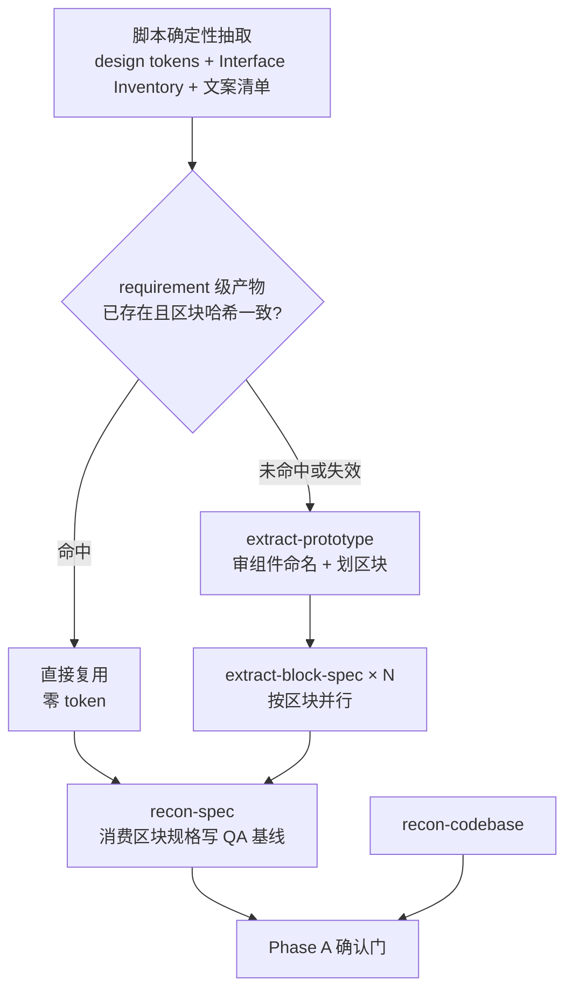

# SDD-Dev-Frontend 方案设计

本文是 `sdd-dev-frontend` skill 的实现蓝图。术语定义见 [CONTEXT.md](./CONTEXT.md)，关键决策的来龙去脉见 [docs/adr/](./docs/adr/)。样式还原验证 V2 由 [ADR-0005](./docs/adr/0005-external-contract-is-primary-restore-evidence.md) 定义：冻结外部设计契约是主要失败证据，截图只补机器盲区。

---

## 一、定位与作用域

**一次运行的作用域是「一个前端仓 × 一个 Story 的 `tasks.md`」。** 跨仓与多 Story 由外层调度，本 skill 不承担。

理由：`tasks.md` 本身就是单仓实现计划且明确禁止跨仓任务，AC 追溯又挂在 Story 上；同时主 agent 亲自承担实现（见 ADR-0002），上下文预算也只够一个 Story。

**本阶段不做的事**：不修改上游设计、不发明响应式规格、不决定对接模式、不跨仓改动。

本阶段依赖独立的 `sdd-init-frontend` 完成前端仓首次接入。baseline 收敛为两层六类：

| 层级 | Baseline |
| --- | --- |
| 仓库级 | `REPO-1` 环境与运行、`REPO-2` 工程质量、`REPO-3` 工程范式 |
| 需求级 | `DEMAND-1` 设计事实、`DEMAND-2` 执行起点、`DEMAND-3` QA 判定 |

Requirement 与 Story 同属需求级，只按自然生命周期落盘。完整字段与失效契约以 [`sdd-init-frontend/references/baseline-contract.md`](../sdd-init-frontend/references/baseline-contract.md) 为准。

---

## 二、输入与产物

### 路径变量

全部路径通过变量引用、**不硬编码**：

| 变量 | 指向 |
| --- | --- |
| `<repo-root>` | 目标前端仓根目录 |
| `<project-sdd-dir>` | SDD 项目产物根目录 |
| `<repo-baseline-dir>` | `<project-sdd-dir>/frontend-baselines/<repo-id>/` |
| `<story-dir>` | Story 的 SDD 产物目录（`tasks.md` / `alpha-tests.md` 所在） |
| `<requirement-dir>` | Requirement 级产物目录 |
| `<prototype-dir>` | HTML 原型目录 |
| `<design-spec-dir>` | 设计稿规格产物目录，取值恒为 `<requirement-dir>/design-spec/` |

仓库接入门先定位仓库与 baseline，步骤 0 再定位四个需求目录。全部唯一命中就静默继续；缺失或多候选时**向用户确认一轮**。结果记入 `dev-baseline.md` 的“执行起点（环境）”。`<design-spec-dir>` 由 `<requirement-dir>` 推得，不单独提问。

变量化的理由是本 skill 要跑在不同仓、不同 SDD 目录布局下。路径写死在提示词里，换一个仓就要逐处改；集中到环境段一处确认，八份 subagent 提示词就都能保持无硬编码路径。`<design-spec-dir>` 之所以要立成正式变量而不是就地写 `<requirement-dir>/design-spec/`，也是这个理由：两份 `extract-*` 提示词里会反复出现这个目录，不立变量就是两处硬编码。

另有一个**可选**变量 `<base-ref>`——本 Story 起点的 git 引用，供代码规范检视与质量检视取改动 diff 用。它可选，是因为取不到时两份检视能自己从 git 状态推断改动范围；为一个可推断的值多占用户一轮确认不划算。

### 输入

| 来源 | 文件 | 本阶段怎么用 |
| --- | --- | --- |
| SDD-Init-Frontend | `repo-baseline.md` / `onboarding-report.md` | 仓库接入门、规范质量命令与仓库唯一工程范式 |
| SDD-Task | `tasks.md` | 唯一执行清单，进度真相 |
| SDD-Design | `story-delta-frontend-design.md` | Story 增量方案 |
| SDD-Design | `requirement-frontend-design.md` | 共享组件清单、对接模式声明 |
| 上游 | HTML 原型 | 还原基线。**只在 A1 抽取段被读一次**，之后全流程读它抽出的产物 |
| 上游 | Test Design 用例 | 功能侧完成标准的输入之一 |

### 产物

| 文件 | 内容来源 | 生命周期 |
| --- | --- | --- |
| `dev-baseline.md` | 规格侧 QA 基线 + 代码侧选择的工程依据 ID | Story 级，冻结后只能显式变更；不复制仓库范式正文 |
| `alpha-tests.md` | 主 agent（扩容既有账本） | Story 级，验收唯一证据源 |
| `dev-review.md` | 四份检视 subagent 回传的正文，主 agent 汇总 | Story 级 |
| `tasks.md` 的 checkbox | 主 agent | 进度真相 |
| `design-tokens.md` / `interface-inventory.md` / `content-inventory.md` | `extract_design_spec.py` 的输出，主 agent 落盘 | **Requirement 级**，只跟设计稿整体哈希 |
| `design-facts.json` | `extract_design_spec.py` 的确定性输出 | **Requirement 级**，覆盖 DOM/CSS、资源内容与缺失状态、区块、结构、文案、token 和布局 |
| `visual-baseline/<fingerprint>/` | 仅 visual YELLOW 时按需生成 | **Requirement 级**，命中只读，失配新建 |
| `block-index.md`（原型切分表） | `extract-prototype` 回传的正文 | **Requirement 级**，按区块哈希增量补行 |
| 区块规格 `blocks/<区块名>.md` | `extract-block-spec` 回传的正文，一区块一文件 | **Requirement 级**，只跟该区块的内容哈希 |
| `restore-contract.json` / `restore-adapter.json` | QA 基线冻结后编译 / 实现定位 | **Story 级**，判定规则与运行适配分离 |
| `restore-report-red.json` / `restore-report-green.json` | 同一冻结契约的机器运行 | **Story 级**，三色报告 |

**落盘一律由主 agent 做，subagent 只回传正文。** 八个 subagent 共用同一条「只读、不改任何文件」的约束，写文件的口子一旦开给其中一个，这条约束就得逐份区分；并行的四份检视又都要进 `dev-review.md`，两份 `extract-block-spec` 又是同时跑多个实例，让它们各自去写文件必然冲突。**脚本不在这条约束里**：它由主 agent 调用，输出由主 agent 写入 `<design-spec-dir>`，脚本不是 subagent。

**baseline 分仓库级与需求级两层落盘，都不进 `<repo-root>`。**

| ID | 产物 | 路径 | 何时作废 |
| --- | --- | --- | --- |
| `REPO-1～3` | manifest、仓库 baseline、人类索引、onboarding report | `<repo-baseline-dir>` | 对应 section 指纹变化 |
| `DEMAND-1` | 四份脚本产物、切分表、区块规格、视觉缓存 | `<design-spec-dir>` | 原型指纹、区块哈希或视觉缓存键变化 |
| `DEMAND-2/3` | `dev-baseline.md`、契约、报告、检视与证据 | `<story-dir>` | Story、执行起点或冻结基线变化 |

Story 级的三份是**这一个 Story 的判定与证据**，与 `tasks.md`、`alpha-tests.md` 同处一地，重跑时才找得到；`design-spec/` 是**设计稿的事实**，设计稿通常整个需求一起给，复用面在 requirement 级而不在 story 级，下一个 Story 直接拿哈希一致的区块规格用。**这条区分要写死**，否则它会被当成「新产物」按 Story 级的老约定挪回 `<story-dir>`，每个 Story 把同一份设计稿重抽一遍。

实现侧截图挂在 `<story-dir>` 下：还原轮只有 visual YELLOW 才写 `<story-dir>/evidence/<Task 编号>-r<轮次>/`，检视阶段仍写 `<story-dir>/evidence/review/`。原型侧截图是 Requirement 级视觉缓存，不复制到 Story。

**四份全局产物有并发写风险。** 区块规格一区块一文件，不同 Story 抽不同区块天然不撞；`design-tokens.md`、`interface-inventory.md`、`content-inventory.md`、`design-facts.json` 都是整份设计稿共一份。规则：首次抽取时生成；完整原型指纹一致时只读不覆盖；变化时写新事实并让旧视觉缓存自然失配。缓存目录以指纹寻址，永不覆盖旧版本。

---

## 三、流程总览

```text
−1. 仓库接入门                  主 agent → 必要时 sdd-init-frontend
0. 需求执行起点                 主 agent
1a. 规格抽取                    脚本（主 agent 调）+ subagent ×(1+N)
1b. 并行勘察 ×2                 subagent
2. 人工确认门（QA 基线冻结）     用户
3. 实现：逐 Task 走 6 步         主 agent
4. 并行检视 ×4                  subagent
5. 收口                         主 agent
```

---

## 四、仓库接入门与步骤 0

先用 `sdd-init-frontend` 的 `status` / `validate` 校验 `<repo-baseline-dir>`。缺失、失效、`DRAFT/BLOCKED`，或当前 Story 受 `READY_WITH_LIMITS` 影响时，自动路由初始化并在完成后返回。仓库必需能力未就绪不能写成 Story 降级。

步骤 0 只生成 `DEMAND-2`：

1. 读取 `REPO-1` 的启动、账号/租户、fixture、API/mock 与浏览器契约；
2. 读取 `REPO-2` 的规范质量命令；
3. 固定 Story 范围、目标路由、`base-ref`、起点 SHA、工作区状态和本次场景；
4. 实跑 test、typecheck、lint、build，记录当前起点的具体失败集合；
5. 记录目标路由、截图与结构化采集的本次可用性；
6. 用 `wc` 判原型形态；资源完整性与原型指纹交 A1 确定性抽取。

仓库 baseline 回答“仓库需要什么、命令怎么跑”；`DEMAND-2` 回答“这一次从什么状态、什么场景开工”。两者不得复制成一份。

---

## 五、步骤 1：规格抽取与并行勘察

本步分两段，每段内部并行：**A1 抽取段**把设计稿的取值搬成产物，**A2 勘察段**在产物之上写 QA 基线与代码事实。全部 subagent 都只读、只回传正文，落盘由主 agent 做（见第二节）。



**分两段的唯一理由是顺序依赖。** `recon-spec` 写还原侧期望值要的是设计稿的具体取值——间距、字号、色值、静态文案，原来它自己读原型拿。取值搬进区块规格、并且它被硬门禁第 9 条禁止再读原型之后，A1 没跑完它就没有输入。`recon-codebase` 不依赖设计稿，仍与它并行放在 A2，让确认门只等一处。

**基线源为第 2 / 3 档（无原型）时整个 A1 跳过**，还原侧期望值按 5.5 取自参照页或文字规格。

### 5.1 A1 抽取段 → `<design-spec-dir>`

**四份确定性产物由脚本产出，零 LLM 参与**：

| 产物 | 内容 |
| --- | --- |
| `design-tokens.md` | 共享类逐条列出：颜色、字号、行高、字重 |
| `interface-inventory.md` | 重复结构模式的签名、实例数、样式值、文案样例，逐个编号 `IC-nn` |
| `content-inventory.md` | 去重文案值，**逐条标记「静态标签」或「动态数据位（占位符）」** |
| `design-facts.json` | 规范化 DOM/CSS 哈希、资源内容/缺失状态、完整原型指纹，以及区块结构、文案、token 和布局声明 |

token 抽取的做法是**共享类与具名类二分**，而不是字面量频次统计。设计稿生成器普遍会把跨元素复用的值抽成单属性的共享工具类（本样本的 `_commonN` 约定），这批类就是生成器已经算好的 design tokens，直接逐条列出即可；具名类的属性分布几乎全是 `margin` / `width` / `height` / `padding` 这类逐元素的一次性尺寸，按区块归属拆进区块规格，不进 token 表。两者混在一起统计，噪声差一个数量级——标准版样本混着数是「29 个颜色 150 个 rem 值」，分开数真正的字号 token 只有 2 个、文字色 2 个。`_commonN` 是这个生成器的约定不是普适规律，脚本的判据写成「单属性且被多处引用」，无此约定时退化为字面量频次统计。

**区块划分与区块规格由两个 subagent 产出**：

- `extract-prototype` — 以脚本产物为唯一入口，按「一屏可截」划页面 → 区块产出切分表，并审 Interface Inventory 的组件命名与变体归并
- `extract-block-spec` — 每实例只读一个区块切片，按 [references/block-spec-template.md](./references/block-spec-template.md) 回传该区块的规格，一区块一文件，按区块并行多实例

两者之间由主 agent 按切分表锚点执行 `extract_design_spec.py block --anchor <锚点> --out <临时路径>`，为每个失配或新增区块物化一份临时切片，再把路径作为实例输入派发。临时切片不是正式工件，不写进 `<design-spec-dir>`；规格落盘后需要时按锚点重建。

区块规格的内容是：区块头（锚点、内容哈希）、引用的组件编号、引用的 token、逐元素布局值、实例数据、R1–R6 覆盖情况。主 agent 在一个还原轮只读当前区块那一份。

三条硬约束：

- **`R4` / `R5` 的「未见」是硬要求。** 静态设计稿里确实没有 hover / focus / disabled / loading 与空态，subagent 不得推断，主 agent 据此登记已知缺口。
- **占位符文案标为「动态数据位」并只给格式模板**，不得作为 R2 的期望值——那是运行时数据，与实现侧的写死文案对不上是正常的。
- **区块规格不带仓内 token 映射，全文不出现 `PATTERN-*`。** 设计稿事实不能绑死到某个仓库范式版本。映射留在 Step ③，由主 agent 根据 `dev-baseline.md / 工程依据` 按 ID 回读仓库 REPO-3；这也保住了 `recon-codebase` 的并行位置。

**区块规格时效按区块级内容哈希，不用文件 mtime。** 只让变了的区块失效并重抽。视觉缓存另按完整原型指纹 + 区块锚点 + 视口 + DPR + 浏览器引擎/版本 + 字体指纹寻址；只改 HTML 空白格式不失效，DOM、CSS、资源内容或缺失状态变化必须失效。

**压缩层的价值随体积变化。** 55K 字符的标准版（≈16K token）通读技术上可行，这一层省的是精度与复用——token 与一次性布局值分离、占位符识别、组件清单；276K 的导出件通读不可能，省的是上下文求生。对 1.1 屏的页面不必夸大成生死问题。

### 5.2 规格侧勘察 → `dev-baseline.md`

产出两块内容。

**（一）功能理解**：本 Story 要做什么，涉及哪些页面与路由，与既有功能的衔接点。简短即可，它服务于下一块，不是独立交付物。

**（二）QA 基线**——本阶段的核心产物，两侧对称。

还原侧固定六维度，Agent 只能填每个维度的具体期望值与豁免项，不得增删维度：

1. 区块与层级完整性
2. 文案一致性
3. 间距与对齐
4. 状态样式（hover / focus / disabled / 选中 / loading）
5. 空态与边界内容
6. 指定视口下的布局完整性

功能侧固定四维度：

1. **AC ↔ 测试层级映射**：每条 AC 指定由 L4 单测、L3 接口集成、浏览器自测中的哪一种或几种覆盖。上游 Test Design 出的是黑盒用例，不管落在哪一层，这一步是本阶段补的。
2. **每条 AC 的可观察判定**：在哪个界面、做什么操作、观察到什么。
3. **必测异常与边界分支清单**：空态、错误态、加载态、边界值、权限。原型不画、AC 不写、Test Design 常常不覆盖，这是最容易漏的一块。
4. **数据与接口契约判定**：请求参数、字段映射、错误码处理。

**豁免规则**：每条豁免必须写理由。典型正当理由是「组件库默认样式与原型不符，但符合本仓既有范式」。

**期望值一律取自区块规格，本 subagent 不读原型。** R2 只取标为「静态标签」的文案；区块规格里写 `未见` 的维度登记为已知缺口，不就地填空。

**原型切分表移交给 `extract-prototype`**，不再由本 subagent 产出，也不再落进 `dev-baseline.md`。原因是它自身矛盾：要给出可核对的区块边界就得通读全稿，大稿子读文件会截断，拿不到完整内容却又被禁止估算——实际结果是静默违规，或回传对不上的边界。切分表现在落 `<design-spec-dir>/block-index.md`，粒度仍是「页面 → 区块」两级，每个区块记录区块名、锚点、内容哈希、视觉职责、归属页面与路由；`dev-baseline.md` 只引用区块名。粒度不做到元素级——再细就变成抄 DOM 了。

### 5.3 代码侧勘察 → `dev-baseline.md / 工程依据`

**重心是从 Requirement 工程决策与仓库 REPO-3 做 Story 选择，不再全仓重抽，也不生成 Story 级范式资产。** 先按 `tasks.md` 圈定当前需要，再按标签或 ID 选读仓库 `PATTERN-*`，并打开其证据复核。

主 agent 只把“Story 需要 → `REQ-DEC-*` / `PATTERN-*`”和 REPO-3 指纹并入 `dev-baseline.md`。范式正文、源码片段和证据表仍只存在于仓库 `repo-baseline.md`。

事实归属只有三种：一次性 Story 细节留在任务与代码证据；跨 Story 的选择进入 Requirement 工程决策；跨 Requirement 的惯例直接刷新 REPO-3。未证实的候选不落盘。

### 5.4 缺背景知识时的分流

执行中缺一块本该有的背景知识，按「读不读得出来」三分流，而不是按重要程度：

| 缺的是 | 动作 |
| --- | --- |
| 事实（项目里有，只是没读） | 起子代理去读，不打断用户 |
| 决策（有多个候选，选哪个要人拍板） | 按 P7 问，或并进最近的确认门 |
| 真缺（穷尽检索后确实没有） | 降级 + 登记 + 告知，不发明 |

**最容易失手的是把第三类当成第二类的反面自行填空**——「读不出来」不等于「由我来定」。第一类的收集一律走子代理：主 agent 在实现阶段边做边探事实，会把「仓内本来怎么做」和「我刚才怎么做的」混在一起。

### 5.5 基线源三档

还原轮的冻结契约必须对照一个**在 Agent 之外**的基线，否则退化成自己写的断言。没有 HTML 原型时基线换源，机制不变：

| 档 | 基线源 | 还原侧期望值取自 | 可信度 |
| --- | --- | --- | --- |
| 1 | HTML 原型 | `<design-spec-dir>` 下该区块的区块规格（取值已由 A1 搬出原型） | 完整 |
| 2 | 参照页（仓内已上线的同类页面） | 参照页实测值与样式/token `PATTERN-*` | 降级：类比基线 |
| 3 | 文字规格 + 仓内 token | 文字规格；R3 / R4 降为「取自选定的样式/token `PATTERN-*`，不得出现字面量」 | 降级：无视觉基线 |

第 2 档是「缺设计稿又要与存量体验一致」的解法。它把这件事拆成事实与决策两半：**参照页候选由 `recon-codebase` 收集**（5.3 节，条件执行），**选哪个作参照并进 Phase A 已有的确认门**。这条降级路径上两份勘察改为串行——`recon-spec` 需要参照页事实才能写还原侧期望值；正常路径仍并行。

第 3 档把承诺收窄到「仓内 token 一致性 + 不破三项 + 文字规格逐条落地」，**不得写出原型级的具体数值**，那是发明规格。

**第 2 / 3 档都跳过 A1**：没有设计稿就没有可抽的取值，`<design-spec-dir>` 保持为空。

### 5.6 无脚本能力时的降级

`extract_design_spec.py` 跑不起来时，按原型形态分两档：

| 原型形态 | 走法 |
| --- | --- |
| 格式化档 | `rg` 按 class 名逐个定位、凑出区块边界；`design-tokens.md` 与 `interface-inventory.md` 不产出，取值改由 `extract-block-spec` 按定位到的行号范围实读现取。登记进 `dev-baseline.md` 环境段的降级项 |
| 单行档 | `rg` 分不了段，**不降级执行**：判基线源不可用并按 P7 上报，请用户提供可执行环境，或改走第 2 / 3 档 |

**两种情形下主 agent 都不直读原型**，硬门禁第 9 条不因降级放宽。早期方案里「用 `rg` 按 `<section>` / `<header>` / `<main>` 分段」这条路已被实测否掉——两份样本各只有 1 个 `section`、0 个其他语义标签。

---

## 六、步骤 2：人工确认门

`dev-baseline.md` 产出后，**必须经用户确认才能开工**。确认对象是 QA 基线（还原侧期望值与豁免、功能侧四维度）。

这是整套设计里防作弊的重心。如果标准不冻结，Agent 遇到难啃的地方会悄悄放宽，最后机器报告照样变绿、AC 照样打勾，证据链空转。

确认后先一次性填完 `dev-baseline.md` 的冻结状态、确认时间和契约固定路径，再把 R1–R6 编译成 `restore-contract.json`，保存 `dev-baseline.md` 的内容哈希；实现 locator 单独写入 `restore-adapter.json`。`contract_sha256` 不回填进基线，只进入报告与证据账本，避免循环哈希。每次执行先校验基线哈希与契约自哈希，不一致就硬失败。

**开工后的变更规则**：要放宽任何标准，必须在 `dev-baseline.md` 记录变更内容与理由，再次请用户确认，并重新编译契约。禁止静默修改契约或用当前实现反推期望值。

---

## 七、步骤 3：实现

### 7.1 6 步与两种失败证据

`tasks.md` 的 6 步 checkbox 编号、顺序、RED/GREEN 语义**完全不变**，唯一扩展是 Step ① 的失败证据分两形态：

- **逻辑补全**：失败的单测或接口集成测试。
- **还原**：冻结外部设计契约的机器报告。至少一项明确 RED 才进入实现；无 RED 但有 YELLOW 不是 GREEN。

一个 Task 内部可以有多轮 6 步。外部基线原则见 [ADR-0001](./docs/adr/0001-restore-uses-diff-list-as-red-evidence.md)，机器证据决策见 [ADR-0005](./docs/adr/0005-external-contract-is-primary-restore-evidence.md)。

还原轮的 6 步长这样：

```text
① RED      校验并运行同一冻结契约，生成 restore-report-red.json；至少一项 RED 才进入实现
② 验 RED    核对 RED 的外部出处与实现 locator；YELLOW 先补结构化证据，仍无法判定才用视觉缓存
③ GREEN     只修报告里的 RED 项
④ 验 GREEN  重跑同一契约；无 RED、无 YELLOW且全量回归不比步骤 0 差
⑤ REFACTOR  按需；重构后重跑同一契约
⑥ 记录证据  把契约哈希、报告路径/指纹/摘要、可选缓存与实现截图写入 alpha-tests.md
```

固定检查层级：

1. **静态预检**：必需文案 / i18n key、仓内 token、禁用字面量和状态选择器。静态通过不能替代 render-required 的 GREEN。
2. **结构化渲染**：浏览器注入只读采集脚本，读取 DOM、`getComputedStyle`、`getBoundingClientRect`、滚动尺寸和触发后的状态，不生成图片。
3. **视觉补证**：只处理阴影观感、字体栅格、图片裁切与复杂叠层等机器盲区。

默认精确匹配文案、数量、顺序、token、枚举和规范化颜色；尺寸、间距、对齐容差 ±1 CSS px；横向溢出、裁切或重叠超过 1 CSS px 为 RED。无法安全表达容差的规则保持 YELLOW，不自行扩大。

R1 映射结构，R2 映射渲染文案，R3 映射 token + 计算样式/几何，R4 映射状态选择器 + 实际状态，R5 在明确 fixture 下检查结构/文案/布局，R6 在指定视口检查滚动/重叠/裁切。R6 纯源码检查不能 GREEN。

初次全 GREEN 时取消该还原轮并落原因；初次只有 YELLOW 时先补证，发现偏差才转 RED，无偏差则取消。无页面能力时 render-required 保持 YELLOW；没有截图能力不影响机器可检项。没有 JSON 契约的历史 Story 继续读取旧截图证据，不要求迁移。

### 7.2 Task 内部顺序

**固定「先还原轮、后逻辑轮」。** 理由是物理依赖——行为要挂在 DOM 上，没有结构就没有挂点。固定顺序也让 Agent 少一个自由决策点。Task 之间按 `tasks.md` 原顺序。

### 7.3 开工前必读

每个 Task 开工前，主 agent 必须先读 `dev-baseline.md / 工程依据`，再按 ID 回读仓库唯一 REPO-3 范式。这是细粒度复用的第一道防线，第二道在检视阶段（见 8.2）。

### 7.4 编译问题的失控约束

三条硬约束：

1. **修复动作不出本 Task 的文件清单。** 需要改清单外的文件才能修好，停下上报，不自行扩大范围。
2. **禁止用 `any`、`@ts-ignore`、`eslint-disable` 绕过。** 除非仓内既有范式就是如此，且必须写明理由。
3. **同一个报错连续修 3 次不成就停止上报**，不继续试。

---

## 八、步骤 4：并行检视

四个 subagent 并行。每个只读、不写任何文件，各自穷尽自己的维度、把分级结论以正文回传，由主 agent 汇总落盘进 `dev-review.md`（见第二节）。

### 8.1 布局与响应式检视

**时机放在最后而不是背景文档里的「还原之后、逻辑之前」**，因为在逻辑补全之前检视的是没有真实数据的骨架——列表只有假数据、文案长度不真实、空态和错误态还不存在、状态样式没触发，那时的结论大半会失效。早期布局问题由还原轮 Step ④ 的结构化机器报告兜住，两者不重复：Step ④ 是单区块对冻结契约，这里是跨页面、真实数据、多视口。

维度：

1. 跨页一致性（同类元素在不同页面的间距、字号、圆角是否一致）
2. 真实数据下的溢出与截断（长文案、长列表、空列表）
3. 目标视口下的「不破」三项：无横向滚动、无重叠、无内容截断
4. 对齐与栅格
5. 真实交互下的状态样式表现
6. 滚动与固定元素行为（吸顶、固钉、滚动容器）

**响应式不发明。** 上游没有规格时只保障「不破」，任何需要改变布局结构的响应式设计记为 Open Question 回问上游，不自行推断。

### 8.2 代码规范检视

**基准是工程依据选中的 `PATTERN-*` / `REQ-DEC-*`**，结论可以被验证对错。维度：

1. 目录与文件命名是否符合仓内约定
2. 组件写法范式是否与既有一致
3. 样式方案是否与仓内一致；**有无硬编码颜色、间距、字号** → 阻断级
4. 请求与错误处理是否走仓内封装，有无裸 fetch、裸 try-catch
5. 公共方法与 hooks 是否复用，**有无本可复用却自己实现** → 建议级
6. 类型定义位置与命名；**有无 `any` / `@ts-ignore` / `eslint-disable`** → 阻断级
7. 国际化与文案是否走仓内既有机制（若有）

第 3 与第 5 项的级别差异是刻意的：公共样式硬编码会造成长期主题不一致且改起来极便宜，公共方法重复实现影响局部、返工成本相对高、偶有正当理由。

### 8.3 质量检视

**与代码规范检视拆开并行。** 两者判据来源完全不同——规范检视有客观的仓内基准，质量检视靠通用工程判断。混在一个 agent 里，有客观基准的那部分会被主观判断稀释，长清单也会让它找到几条就提前收敛。维度：

1. 组件职责与体积
2. 重复代码
3. 复杂度与嵌套深度
4. 状态放置是否合理
5. 副作用管理（依赖、清理、竞态）
6. 错误与边界处理完整性
7. 死代码与遗留；**调试语句** → 阻断级
8. 明显性能问题（渲染中创建大对象、缺 key、大列表未虚拟化）

### 8.4 功能自测试

在浏览器里实跑，判据来自冻结的 QA 基线功能侧，编号沿用基线行号，不另造一套。

**先对账 `F1`（AC ↔ 测试层级映射），它是范围决定项而不是实跑项。** F1 给每条 AC 指定的层级决定了下面几项要跑哪些 AC；同时它堵住「层级声明了却没人做」这个口子——声明了 L4 或 L3 却查无对应测试，就是 AC 未覆盖。功能侧四维度里唯独它不落在界面上，最容易在实跑清单里被漏掉。

对完账再实跑：

1. 逐条执行「每条 AC 的可观察判定」（`F2`）
2. 逐条执行「必测异常与边界分支清单」（`F3`）
3. 接口契约实测：请求参数、字段映射、错误码处理（`F4`）
4. 本 Story 涉及页面的既有主路径回归

**第 4 项不属于功能侧四维度**，基线里没有与它对应的行——它的出处是本节这一项与第九节的回归门禁，判据是 `DEMAND-2` 记下的起点失败集合。所以它单独编号 `REG-n`，不并进 `F` 编号。

---

## 九、分级门禁

**阻断级**（必须修完才能收口）：AC 未覆盖、占位符（TBD / TODO / 无代码步骤）、类型错误、还原报告存在 RED / YELLOW 且未逐条命中冻结豁免、测试红、回归相对 `DEMAND-2` 起点变差、公共样式硬编码、调试语句残留、`any` / `@ts-ignore` / `eslint-disable` 无理由绕过。

**建议级**（写入 `dev-review.md` 不阻断）：可读性、可访问性、性能优化、公共方法重复实现、命名改进、裸 fetch 与裸 try-catch（8.2 第 4 项）。

**上面的阻断清单不是穷举。** 它列的是最容易被磨掉的那几项，竞态、内存泄漏、effect 无限循环这类问题一条都没进去，而把它们判成建议级，等于同意带着已知缺陷收口。所以补一条分级规则：**确证的功能缺陷即阻断**——一条发现只要能给出具体的触发操作序列、且该序列会产生错误结果，就是阻断级，不管它落在哪个维度。

**「确证」是硬条件，给不出触发序列的推测不适用本条。** 不设这道硬条件，「万一将来出问题」可以套到任何一条结论上，两档分级就失效了。

**裸 fetch 与裸 try-catch 判建议级，和公共样式硬编码相反，差别在修复成本这一轴**：改一处裸 fetch 走封装会变更鉴权头、错误码映射、重试与取消的运行时行为，而此时全部 Task 已经 GREEN，为一条没有失败证据支撑的结论去动行为，是在收口前引入风险。真正有害的情形不会漏网——吞掉错误导致 `F3` 的错误态不成立、少了鉴权头导致请求失败，分别被 `F3` 与 `F4` 接住，届时按「确证的功能缺陷即阻断」与「命中已冻结基线即阻断」升级。完整判据见 [references/review-dimensions.md](./references/review-dimensions.md) 4.3。

---

## 十、Deferred 与对接模式

对接模式**严格执行上游 `requirement-frontend-design.md` 的声明**，本阶段不做决策。

上游未声明而接口实际不可用时：降级为静态实现模式，并把受影响的 AC 在 `alpha-tests.md` 的证据映射中标为 `Deferred`，写明原因与解除条件。**带 Deferred 标记的 AC 不计为已验收，不得静默通过。**

---

## 十一、`alpha-tests.md` 扩容

现有四节保持不变，新增与修改如下：

**新增「还原证据记录」一节**，位置在 L3 集成测试记录之后、AC ↔ 证据映射之前。每条记录只包含：Task 与区块、原型指纹、基线与契约哈希、RED / GREEN 报告路径和指纹、三色摘要、回归摘要，以及可选视觉缓存指纹和实现截图。完整逐规则结果保留在机器报告，不复制第二本账。

**扩展「AC ↔ 证据映射」一节**：证据类型列新增「还原」，一条 AC 可同时挂多类证据；新增状态列（`GREEN` / `Deferred`），`Deferred` 必须附原因与解除条件。

这样 `alpha-tests.md` 仍是验收追溯的唯一证据源，不另开第二本账。

---

## 十二、上游 `sdd-task` 回改需求

本方案溢出到上游的部分，分两组，各落成一份可直接带去上游的说明书。

**第一组——失败证据形态**（[references/sdd-task-amendments.md](./references/sdd-task-amendments.md)），三处：

1. **执行规则节**：TDD Iron Law 补一句——「前端还原类工作的失败证据为冻结外部设计契约的明确 RED；除此之外，没有失败证据不写实现」。
2. **Task List 节**：Step ① 的模板文案改为两形态并列，并明确一个 Task 内允许多轮 6 步。
3. **计划自审三查（前端行）**：新增一查——「每个前端 Task 的每一轮 6 步，Step ① 是否明确标注了失败证据形态」。

**第二组——Task 切分方式**（[references/sdd-task-frontend-split.md](./references/sdd-task-frontend-split.md)），五条要求：整页样式集中成一个独立还原 Task、跨页公共样式与骨架单独成 Task 排最前、还原 Task 独占样式文件、还原 Task 逐区块给稳定锚点且由一组契约规则完整覆盖、禁止收尾性质的样式 Task；外加前端行自审两查。

两组的关系：第一组让还原类工作在 `tasks.md` 里有合法的失败证据形态，第二组让这个形态**能真正 GREEN**——样式散落在多个 Task 时，前一轮 GREEN 报告会被后一轮推翻。第二组未落地时下游仍可执行，退回「一个 Task 内多轮 6 步」，代价是契约重跑成本按碰样式的 Task 数增加。

---

## 十三、目录结构与入口

```text
skills/sdd-dev-frontend/
├── SKILL.md                    编排主控 + 单步入口路由
├── CONTEXT.md                  术语表
├── 方案设计.md                  本文
├── docs/adr/                   关键决策记录
├── scripts/
│   ├── extract_design_spec.py       设计事实、原型指纹、区块与视觉缓存
│   ├── verify_restore_contract.py  冻结契约、静态预检、三色报告与旧证据检测
│   └── collect_restore_facts.js    浏览器只读结构化采集片段
├── agents/
│   ├── extract-prototype.md    划页面 → 区块、审组件命名
│   ├── extract-block-spec.md   单区块规格
│   ├── recon-spec.md           规格侧勘察
│   ├── recon-codebase.md       代码侧勘察
│   ├── review-layout.md        布局与响应式检视
│   ├── review-convention.md    代码规范检视
│   ├── review-quality.md       质量检视
│   └── self-test.md            功能自测试
└── references/
    ├── qa-baseline-template.md     QA 基线模板（固定维度）
    ├── block-spec-template.md      区块规格模板
    ├── restore-contract.md         机器工件 schema、命令与三色语义
    ├── diff-list-template.md       机器报告人类摘要模板
    ├── review-dimensions.md        四份检视的维度清单
    ├── alpha-tests-restore.md      还原证据记录节的结构
    ├── sdd-task-amendments.md      上游回改需求：失败证据形态
    └── sdd-task-frontend-split.md  上游回改需求：前端 Task 切分方式
```

**`references/` 里为什么有两份回改说明书。** 第十二节要改的是 `sdd-task`，它由上游维护，本 skill 改不到。落成自包含的说明书由用户带去上游照着改——否则这些需求只存在于本文里，没有任何形式能被上游接收。

**八个 subagent 不注册为独立 skill。** 它们的前置条件很强，但 description 写出来会是「检视前端布局与响应式」「解析 HTML 设计稿」这类通用句子，极易被无关请求自动匹配走；被单独触发时前置全缺，只能空转。改由主 `SKILL.md` 提供单步入口路由：用户用自然语言说「只做勘察」「重抽设计稿规格」「重跑布局检视」，主 skill 校验前置产物是否齐备，齐了就派发，缺了就明确告知缺什么。

**设计稿抽取也不独立成 skill**，理由同上：它的 description 会是「解析 HTML 设计稿」这类通用句，而它的前置（脚本产物、路径变量、基线源判定）全在本 skill 里。

---

## 十四、前置产物校验

每个 subagent 提示词开头都有一段前置校验，不满足则立即返回「前置缺失：<清单>」并终止，**不做任何猜测性工作**。

| subagent | 前置要求 |
| --- | --- |
| 设计稿切分 | `<design-spec-dir>` 下四份脚本产物（含 `design-facts.json`）齐全且可读；环境段「原型形态」已探明 |
| 区块规格 | 本实例负责的那一个区块切片；`references/block-spec-template.md` 可读；`design-tokens.md` 与 `interface-inventory.md` 可读 |
| 规格侧勘察 | `tasks.md`、`story-delta-frontend-design.md` 可读；`<design-spec-dir>` 下本 Story 相关的区块规格与切分表可读；`references/qa-baseline-template.md` 可读 |
| 代码侧勘察 | 目标仓可访问；仓库 `status` / `validate` 通过；REPO-3 可读；`tasks.md` 存在 |
| 布局与响应式检视 | `dev-baseline.md` 已冻结；环境段截图为「可」、起页面为「可」；本 Story 全部 Task 已 GREEN |
| 代码规范检视 | `dev-baseline.md / 工程依据` 存在且 REPO-3 指纹有效；本 Story 改动 diff 可取 |
| 质量检视 | 目标仓路径可访问；本 Story 改动 diff 可取 |
| 功能自测试 | `dev-baseline.md` 已冻结且功能侧 `F1`–`F4` 四张表齐全；环境段起页面为「可」且能按其命令与端口实际打开目标页面；本 Story 全部 Task 已 GREEN |

本表是八段前置校验的摘要，**与 `agents/` 下八份提示词不一致时以提示词为准**。

---

## 十五、失败恢复

**`tasks.md` 的 checkbox 是唯一进度真相。** 重跑时先读 checkbox 与 `alpha-tests.md`，从第一个未完成的 Task 继续。

勘察产物存在且 Story 未变更时跳过重跑；`dev-baseline.md` 已冻结时不重新走确认门。检视报告一律重跑，不复用旧结论——代码已经变了。

`<design-spec-dir>` 下的区块规格按**区块级内容哈希**判复用；`design-facts.json` 与视觉缓存按覆盖 DOM/CSS、资源内容和缺失状态的完整原型指纹判复用。视觉缓存再加入锚点、视口、DPR、浏览器引擎/版本和字体指纹；命中只读，失配创建新目录。

Story 继续执行前先用 `verify_restore_contract.py validate` 核对 `dev-baseline.md`、`restore-contract.json` 与 `restore-adapter.json`。报告可以重跑，冻结契约不能根据当前实现修改；确需变更先回到确认门。
